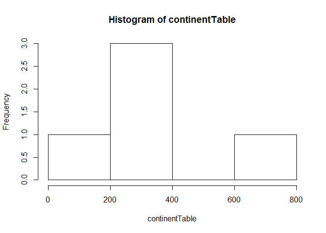

<https://github.com/jmurthy12/STAT545-hw02-murthy-janani>
================

Bring rectangular data in

``` r
library(gapminder)
library(tidyverse)
```

    ## Loading tidyverse: ggplot2
    ## Loading tidyverse: tibble
    ## Loading tidyverse: tidyr
    ## Loading tidyverse: readr
    ## Loading tidyverse: purrr
    ## Loading tidyverse: dplyr

    ## Conflicts with tidy packages ----------------------------------------------

    ## filter(): dplyr, stats
    ## lag():    dplyr, stats

### Smell test the data

Explore the gapminder object:

1)Is it a data.frame, a matrix, a vector, a list?

Answer : Gapminder object is a data frame .

``` r
gapminder
```

    ## # A tibble: 1,704 x 6
    ##        country continent  year lifeExp      pop gdpPercap
    ##         <fctr>    <fctr> <int>   <dbl>    <int>     <dbl>
    ##  1 Afghanistan      Asia  1952  28.801  8425333  779.4453
    ##  2 Afghanistan      Asia  1957  30.332  9240934  820.8530
    ##  3 Afghanistan      Asia  1962  31.997 10267083  853.1007
    ##  4 Afghanistan      Asia  1967  34.020 11537966  836.1971
    ##  5 Afghanistan      Asia  1972  36.088 13079460  739.9811
    ##  6 Afghanistan      Asia  1977  38.438 14880372  786.1134
    ##  7 Afghanistan      Asia  1982  39.854 12881816  978.0114
    ##  8 Afghanistan      Asia  1987  40.822 13867957  852.3959
    ##  9 Afghanistan      Asia  1992  41.674 16317921  649.3414
    ## 10 Afghanistan      Asia  1997  41.763 22227415  635.3414
    ## # ... with 1,694 more rows

2)What’s its class?

Answer : Class is Tibble.

``` r
class(gapminder)
```

    ## [1] "tbl_df"     "tbl"        "data.frame"

OR An alternative way is to find the number of rows and columns is mentioned below :

``` r
str(gapminder)
```

    ## Classes 'tbl_df', 'tbl' and 'data.frame':    1704 obs. of  6 variables:
    ##  $ country  : Factor w/ 142 levels "Afghanistan",..: 1 1 1 1 1 1 1 1 1 1 ...
    ##  $ continent: Factor w/ 5 levels "Africa","Americas",..: 3 3 3 3 3 3 3 3 3 3 ...
    ##  $ year     : int  1952 1957 1962 1967 1972 1977 1982 1987 1992 1997 ...
    ##  $ lifeExp  : num  28.8 30.3 32 34 36.1 ...
    ##  $ pop      : int  8425333 9240934 10267083 11537966 13079460 14880372 12881816 13867957 16317921 22227415 ...
    ##  $ gdpPercap: num  779 821 853 836 740 ...

3)How many variables/columns? There are 6 variables/coulmns . The Variables are : country,continent,year,lifeExp,pop,gdpPercap

``` r
gapminder
```

    ## # A tibble: 1,704 x 6
    ##        country continent  year lifeExp      pop gdpPercap
    ##         <fctr>    <fctr> <int>   <dbl>    <int>     <dbl>
    ##  1 Afghanistan      Asia  1952  28.801  8425333  779.4453
    ##  2 Afghanistan      Asia  1957  30.332  9240934  820.8530
    ##  3 Afghanistan      Asia  1962  31.997 10267083  853.1007
    ##  4 Afghanistan      Asia  1967  34.020 11537966  836.1971
    ##  5 Afghanistan      Asia  1972  36.088 13079460  739.9811
    ##  6 Afghanistan      Asia  1977  38.438 14880372  786.1134
    ##  7 Afghanistan      Asia  1982  39.854 12881816  978.0114
    ##  8 Afghanistan      Asia  1987  40.822 13867957  852.3959
    ##  9 Afghanistan      Asia  1992  41.674 16317921  649.3414
    ## 10 Afghanistan      Asia  1997  41.763 22227415  635.3414
    ## # ... with 1,694 more rows

4)How many rows/observations? Answer : There are 1,1704 rows/observartions

5)Can you get these facts about “extent” or “size” in more than one way? Can you imagine different functions being useful in different contexts?

``` r
dim(gapminder)
```

    ## [1] 1704    6

``` r
nrow(gapminder)
```

    ## [1] 1704

``` r
ncol(gapminder)
```

    ## [1] 6

``` r
length(gapminder$country)
```

    ## [1] 1704

6)What data type is each variable?

``` r
class(gapminder$country)
```

    ## [1] "factor"

``` r
class(gapminder$continent)
```

    ## [1] "factor"

``` r
class(gapminder$year)
```

    ## [1] "integer"

``` r
class(gapminder$lifeExp)
```

    ## [1] "numeric"

``` r
class(gapminder$pop)
```

    ## [1] "integer"

``` r
class(gapminder$gdpPercap)
```

    ## [1] "numeric"

### Explore individual variables :

1)Pick at least one categorical variable and at least one quantitative variable to explore.

Answer : We extract the continent variable as an example for a categorical variable and the lifeExp as continuous variable ContinentVar &lt;- gapminder*c**o**n**t**i**n**e**n**t**l**i**f**e**E**x**p**V**a**r* &lt; −*g**a**p**m**i**n**d**e**r*lifeExp

``` r
ContinentVar <- gapminder$continent
lifeExpVar <- gapminder$lifeExp
```

2)What are possible values (or range, whichever is appropriate) of each variable? continentTable &lt;- table(ContinentVar) What values are typical? What’s the spread? What’s the distribution? Etc., tailored to the variable at hand. Feel free to use summary stats, tables, figures. We’re NOT expecting high production value (yet).

``` r
continentTable <- table(ContinentVar)
continentTable
```

    ## ContinentVar
    ##   Africa Americas     Asia   Europe  Oceania 
    ##      624      300      396      360       24

``` r
hist(continentTable)
```



``` r
range(lifeExpVar)
```

    ## [1] 23.599 82.603

``` r
mean(lifeExpVar)
```

    ## [1] 59.47444

``` r
sd(lifeExpVar)
```

    ## [1] 12.91711

Explore various plot types
--------------------------

See the ggplot2 tutorial, which also uses the gapminder data, for ideas.

Make a few plots, probably of the same variable you chose to characterize numerically. Try to explore more than one plot type. Just as an example of what I mean:

    A scatterplot of two quantitative variables.
    A plot of one quantitative variable. Maybe a histogram or densityplot or frequency polygon.
    A plot of one quantitative variable and one categorical. Maybe boxplots for several continents or countries.

``` r
library(gapminder)
library("ggplot2")
ggplot(gapminder, aes(x = lifeExp, y = gdpPercap)) +
  geom_point()
```


``` r
ggplot(gapminder, aes(x = ))
```


