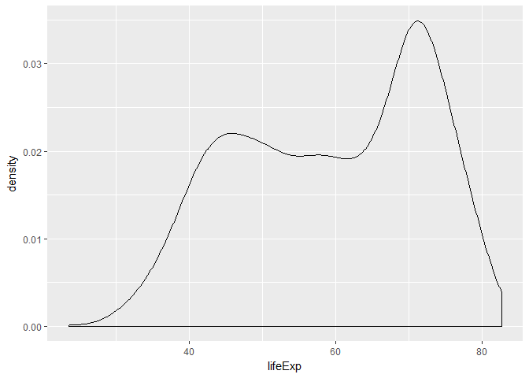
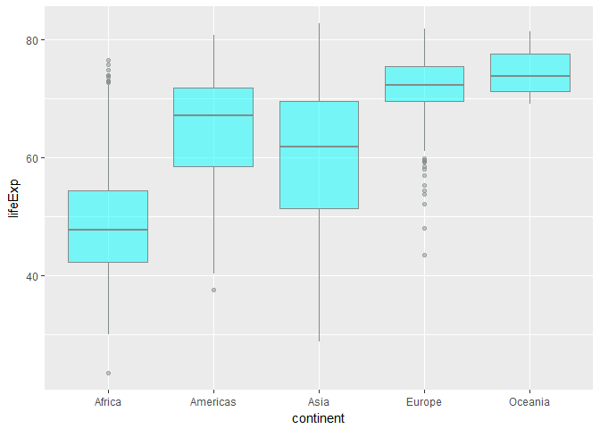
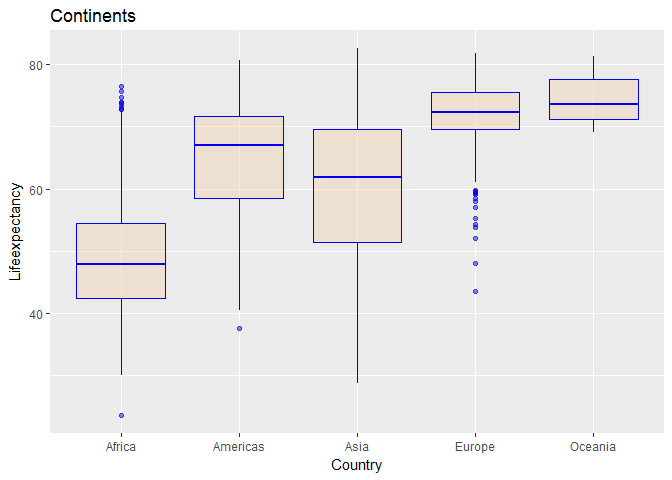
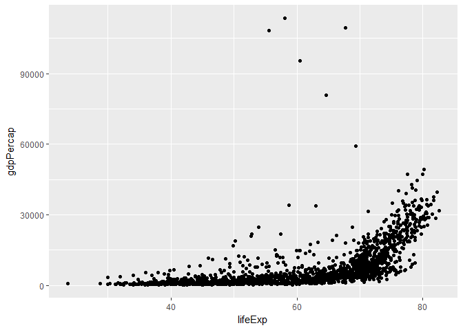
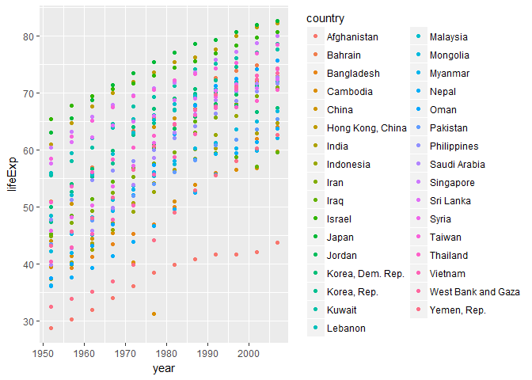

<https://github.com/jmurthy12/STAT545-hw02-murthy-janani>
================

Exploring Gapminder!
====================

### Bring rectangular data in

``` r
library(gapminder)
library(tidyverse)
```

    ## Loading tidyverse: ggplot2
    ## Loading tidyverse: tibble
    ## Loading tidyverse: tidyr
    ## Loading tidyverse: readr
    ## Loading tidyverse: purrr
    ## Loading tidyverse: dplyr

    ## Conflicts with tidy packages ----------------------------------------------

    ## filter(): dplyr, stats
    ## lag():    dplyr, stats

### Smell test the data

Explore the gapminder object:

1)Is it a data.frame, a matrix, a vector, a list?

Answer : List.Gapminder is a dataframe and a List.

``` r
is.data.frame(gapminder)
```

    ## [1] TRUE

``` r
is.list(gapminder)
```

    ## [1] TRUE

``` r
typeof(gapminder)
```

    ## [1] "list"

2)What's its class?

Answer : Class is dataframe and also a tibble.

``` r
class(gapminder)
```

    ## [1] "tbl_df"     "tbl"        "data.frame"

``` r
gapminder
```

    ## # A tibble: 1,704 x 6
    ##        country continent  year lifeExp      pop gdpPercap
    ##         <fctr>    <fctr> <int>   <dbl>    <int>     <dbl>
    ##  1 Afghanistan      Asia  1952  28.801  8425333  779.4453
    ##  2 Afghanistan      Asia  1957  30.332  9240934  820.8530
    ##  3 Afghanistan      Asia  1962  31.997 10267083  853.1007
    ##  4 Afghanistan      Asia  1967  34.020 11537966  836.1971
    ##  5 Afghanistan      Asia  1972  36.088 13079460  739.9811
    ##  6 Afghanistan      Asia  1977  38.438 14880372  786.1134
    ##  7 Afghanistan      Asia  1982  39.854 12881816  978.0114
    ##  8 Afghanistan      Asia  1987  40.822 13867957  852.3959
    ##  9 Afghanistan      Asia  1992  41.674 16317921  649.3414
    ## 10 Afghanistan      Asia  1997  41.763 22227415  635.3414
    ## # ... with 1,694 more rows

OR

An alternative way is to find the number of rows and columns as mentioned below :

``` r
str(gapminder)
```

    ## Classes 'tbl_df', 'tbl' and 'data.frame':    1704 obs. of  6 variables:
    ##  $ country  : Factor w/ 142 levels "Afghanistan",..: 1 1 1 1 1 1 1 1 1 1 ...
    ##  $ continent: Factor w/ 5 levels "Africa","Americas",..: 3 3 3 3 3 3 3 3 3 3 ...
    ##  $ year     : int  1952 1957 1962 1967 1972 1977 1982 1987 1992 1997 ...
    ##  $ lifeExp  : num  28.8 30.3 32 34 36.1 ...
    ##  $ pop      : int  8425333 9240934 10267083 11537966 13079460 14880372 12881816 13867957 16317921 22227415 ...
    ##  $ gdpPercap: num  779 821 853 836 740 ...

3)How many variables/columns?

Answer :There are 6 variables/coulmns . The Variables are : country,continent,year,lifeExp,pop and gdpPercap

``` r
gapminder
```

    ## # A tibble: 1,704 x 6
    ##        country continent  year lifeExp      pop gdpPercap
    ##         <fctr>    <fctr> <int>   <dbl>    <int>     <dbl>
    ##  1 Afghanistan      Asia  1952  28.801  8425333  779.4453
    ##  2 Afghanistan      Asia  1957  30.332  9240934  820.8530
    ##  3 Afghanistan      Asia  1962  31.997 10267083  853.1007
    ##  4 Afghanistan      Asia  1967  34.020 11537966  836.1971
    ##  5 Afghanistan      Asia  1972  36.088 13079460  739.9811
    ##  6 Afghanistan      Asia  1977  38.438 14880372  786.1134
    ##  7 Afghanistan      Asia  1982  39.854 12881816  978.0114
    ##  8 Afghanistan      Asia  1987  40.822 13867957  852.3959
    ##  9 Afghanistan      Asia  1992  41.674 16317921  649.3414
    ## 10 Afghanistan      Asia  1997  41.763 22227415  635.3414
    ## # ... with 1,694 more rows

4)How many rows/observations?

Answer : There are 1,1704 rows/observartions

5)Can you get these facts about "extent" or "size" in more than one way? Can you imagine different functions being useful in different contexts?

Answer : Various methods/functions to find the "extent" or "size" are described below :

``` r
dim(gapminder)
```

    ## [1] 1704    6

``` r
nrow(gapminder)
```

    ## [1] 1704

``` r
ncol(gapminder)
```

    ## [1] 6

``` r
head(gapminder) #gives the number of columns and data types for each column
```

    ## # A tibble: 6 x 6
    ##       country continent  year lifeExp      pop gdpPercap
    ##        <fctr>    <fctr> <int>   <dbl>    <int>     <dbl>
    ## 1 Afghanistan      Asia  1952  28.801  8425333  779.4453
    ## 2 Afghanistan      Asia  1957  30.332  9240934  820.8530
    ## 3 Afghanistan      Asia  1962  31.997 10267083  853.1007
    ## 4 Afghanistan      Asia  1967  34.020 11537966  836.1971
    ## 5 Afghanistan      Asia  1972  36.088 13079460  739.9811
    ## 6 Afghanistan      Asia  1977  38.438 14880372  786.1134

``` r
length(gapminder) # gives the number of columns
```

    ## [1] 6

6)What data type is each variable?

``` r
class(gapminder$country)
```

    ## [1] "factor"

``` r
class(gapminder$continent)
```

    ## [1] "factor"

``` r
class(gapminder$year)
```

    ## [1] "integer"

``` r
class(gapminder$lifeExp)
```

    ## [1] "numeric"

``` r
class(gapminder$pop)
```

    ## [1] "integer"

``` r
class(gapminder$gdpPercap)
```

    ## [1] "numeric"

OR,

alternatively we could use the str() command

``` r
str(gapminder) # gives the consolidated data type for each variable/column.
```

    ## Classes 'tbl_df', 'tbl' and 'data.frame':    1704 obs. of  6 variables:
    ##  $ country  : Factor w/ 142 levels "Afghanistan",..: 1 1 1 1 1 1 1 1 1 1 ...
    ##  $ continent: Factor w/ 5 levels "Africa","Americas",..: 3 3 3 3 3 3 3 3 3 3 ...
    ##  $ year     : int  1952 1957 1962 1967 1972 1977 1982 1987 1992 1997 ...
    ##  $ lifeExp  : num  28.8 30.3 32 34 36.1 ...
    ##  $ pop      : int  8425333 9240934 10267083 11537966 13079460 14880372 12881816 13867957 16317921 22227415 ...
    ##  $ gdpPercap: num  779 821 853 836 740 ...

``` r
summary(gapminder)
```

    ##         country        continent        year         lifeExp     
    ##  Afghanistan:  12   Africa  :624   Min.   :1952   Min.   :23.60  
    ##  Albania    :  12   Americas:300   1st Qu.:1966   1st Qu.:48.20  
    ##  Algeria    :  12   Asia    :396   Median :1980   Median :60.71  
    ##  Angola     :  12   Europe  :360   Mean   :1980   Mean   :59.47  
    ##  Argentina  :  12   Oceania : 24   3rd Qu.:1993   3rd Qu.:70.85  
    ##  Australia  :  12                  Max.   :2007   Max.   :82.60  
    ##  (Other)    :1632                                                
    ##       pop              gdpPercap       
    ##  Min.   :6.001e+04   Min.   :   241.2  
    ##  1st Qu.:2.794e+06   1st Qu.:  1202.1  
    ##  Median :7.024e+06   Median :  3531.8  
    ##  Mean   :2.960e+07   Mean   :  7215.3  
    ##  3rd Qu.:1.959e+07   3rd Qu.:  9325.5  
    ##  Max.   :1.319e+09   Max.   :113523.1  
    ## 

### Explore individual variables :

1)Pick at least one categorical variable and at least one quantitative variable to explore.

Answer : Categorical variable : continent
Quantitative variable : life expectancy(lifeExp)

``` r
ContinentVariable <- gapminder$continent
lifeExpVariable <- gapminder$lifeExp
```

2)What are possible values (or range, whichever is appropriate) of each variable? What values are typical? What’s the spread? What’s the distribution? Etc., tailored to the variable at hand. Feel free to use summary stats, tables, figures. We’re NOT expecting high production value (yet).

``` r
continentTable <- table(ContinentVariable)
continentTable
```

    ## ContinentVariable
    ##   Africa Americas     Asia   Europe  Oceania 
    ##      624      300      396      360       24

``` r
hist(continentTable) #Distribution of Continent (Similar to frequency distribution)
```


``` r
range(lifeExpVariable) # Range of Life Expectancy
```

    ## [1] 23.599 82.603

``` r
hist(lifeExpVariable) #Distribution of ife Expectency
```


``` r
mean(lifeExpVariable) # Mean/Average of ife Expectancy
```

    ## [1] 59.47444

``` r
sd(lifeExpVariable) # Standard Deviation of Life Expectancy
```

    ## [1] 12.91711

Exploring continents and Life expectancy

``` r
    gapminder %>%
      filter(continent== "Asia") %>%
      group_by(year) %>%
      summarise (minexp = min(lifeExp),
             maxexp = max(lifeExp)) # displays the minimum and maximum Life expectancy
```

    ## # A tibble: 12 x 3
    ##     year minexp maxexp
    ##    <int>  <dbl>  <dbl>
    ##  1  1952 28.801 65.390
    ##  2  1957 30.332 67.840
    ##  3  1962 31.997 69.390
    ##  4  1967 34.020 71.430
    ##  5  1972 36.088 73.420
    ##  6  1977 31.220 75.380
    ##  7  1982 39.854 77.110
    ##  8  1987 40.822 78.670
    ##  9  1992 41.674 79.360
    ## 10  1997 41.763 80.690
    ## 11  2002 42.129 82.000
    ## 12  2007 43.828 82.603

``` r
unique(gapminder$continent) #gives the distinct countries within continent Variable set
```

    ## [1] Asia     Europe   Africa   Americas Oceania 
    ## Levels: Africa Americas Asia Europe Oceania

Explore various plot types
--------------------------

See the ggplot2 tutorial, which also uses the gapminder data, for ideas.

##### Make a few plots, probably of the same variable you chose to characterize numerically. Try to explore more than one plot type. Just as an example of what I mean:

A scatterplot of two quantitative variables.

Quantitative variable 1 : Life Expectancy

Quantitative variable 2 : Population

``` r
ggplot(gapminder, 
      aes(x=lifeExp, y=pop)) +
      geom_point(size = 2, color = "indianred4")
```


    A plot of one quantitative variable. Maybe a histogram or densityplot or frequency polygon.

    Densityplot of  quantitative variable: LifeExpectancy

``` r
ggplot(gapminder, aes(x=lifeExp)) + geom_density()
```



A plot of one quantitative variable and one categorical

Answer : Box plot of quantitative variable : LifeExpectancy vs categorical variable : Continent

``` r
ggplot(gapminder,
      aes(x = continent, y = lifeExp)) +
      geom_boxplot(colour = "azure4", fill = "cyan", alpha = 0.5)
```



     Maybe boxplots for several continents or countries.

``` r
ggplot(gapminder,
      aes(x=continent, y=lifeExp)) +
      geom_boxplot(colour = "blue2", fill = "bisque2", alpha = 0.5) +
      ggtitle("Continents") +
      labs(x = "Country", y = "Lifeexpectancy")
```



``` r
ggplot(gapminder, aes(x = lifeExp, y = gdpPercap)) +
  geom_point()
```



``` r
ggplot(gapminder, aes(x =lifeExp, y = year))+
  geom_point()
```


Use filter(), select() and %&gt;% Use filter() to create data subsets that you want to plot.

Practice piping together filter() and select(). Possibly even piping into ggplot().

Answer : All the above functionaities mentioned above are excuted in the chunk below.

Scatter Plot describing the LifeExpectency by year for each country within the Asian Continent.

``` r
gapminder %>%
  filter(continent=="Asia") %>% 
  select(country, year, lifeExp) %>% 
  ggplot(aes(x=year, y=lifeExp)) %>% 
  + geom_point(aes(color=country))
```



### But I want to do more!

For people who want to take things further.

Evaluate this code and describe the result. Presumably the analyst’s intent was to get the data for Rwanda and Afghanistan. Did they succeed? Why or why not? If not, what is the correct way to do this?

``` r
filter(gapminder, country == c("Rwanda", "Afghanistan"))
```

    ## # A tibble: 12 x 6
    ##        country continent  year lifeExp      pop gdpPercap
    ##         <fctr>    <fctr> <int>   <dbl>    <int>     <dbl>
    ##  1 Afghanistan      Asia  1957  30.332  9240934  820.8530
    ##  2 Afghanistan      Asia  1967  34.020 11537966  836.1971
    ##  3 Afghanistan      Asia  1977  38.438 14880372  786.1134
    ##  4 Afghanistan      Asia  1987  40.822 13867957  852.3959
    ##  5 Afghanistan      Asia  1997  41.763 22227415  635.3414
    ##  6 Afghanistan      Asia  2007  43.828 31889923  974.5803
    ##  7      Rwanda    Africa  1952  40.000  2534927  493.3239
    ##  8      Rwanda    Africa  1962  43.000  3051242  597.4731
    ##  9      Rwanda    Africa  1972  44.600  3992121  590.5807
    ## 10      Rwanda    Africa  1982  46.218  5507565  881.5706
    ## 11      Rwanda    Africa  1992  23.599  7290203  737.0686
    ## 12      Rwanda    Africa  2002  43.413  7852401  785.6538

##### Similar excercise was done in class cm006 and the explaination was provided in the same class.

Explaination :The above chunk only displays countries(afghanistan and Rwanda)/rows for which the year value/columns are unique. Repetitions are omitted.Hence it displays 12 rows only instead of 24 rows.

Solution : To display all the data for country Rwanda nd Afghanistan, use the below :

``` r
filter(gapminder, country == "Rwanda" | country == "Afghanistan") # As discussed in class cm006
```

    ## # A tibble: 24 x 6
    ##        country continent  year lifeExp      pop gdpPercap
    ##         <fctr>    <fctr> <int>   <dbl>    <int>     <dbl>
    ##  1 Afghanistan      Asia  1952  28.801  8425333  779.4453
    ##  2 Afghanistan      Asia  1957  30.332  9240934  820.8530
    ##  3 Afghanistan      Asia  1962  31.997 10267083  853.1007
    ##  4 Afghanistan      Asia  1967  34.020 11537966  836.1971
    ##  5 Afghanistan      Asia  1972  36.088 13079460  739.9811
    ##  6 Afghanistan      Asia  1977  38.438 14880372  786.1134
    ##  7 Afghanistan      Asia  1982  39.854 12881816  978.0114
    ##  8 Afghanistan      Asia  1987  40.822 13867957  852.3959
    ##  9 Afghanistan      Asia  1992  41.674 16317921  649.3414
    ## 10 Afghanistan      Asia  1997  41.763 22227415  635.3414
    ## # ... with 14 more rows

OR

``` r
gapminder %>%
  filter(country %in% c("Rwanda", "Afghanistan"))  # As discussed in class cm006
```

    ## # A tibble: 24 x 6
    ##        country continent  year lifeExp      pop gdpPercap
    ##         <fctr>    <fctr> <int>   <dbl>    <int>     <dbl>
    ##  1 Afghanistan      Asia  1952  28.801  8425333  779.4453
    ##  2 Afghanistan      Asia  1957  30.332  9240934  820.8530
    ##  3 Afghanistan      Asia  1962  31.997 10267083  853.1007
    ##  4 Afghanistan      Asia  1967  34.020 11537966  836.1971
    ##  5 Afghanistan      Asia  1972  36.088 13079460  739.9811
    ##  6 Afghanistan      Asia  1977  38.438 14880372  786.1134
    ##  7 Afghanistan      Asia  1982  39.854 12881816  978.0114
    ##  8 Afghanistan      Asia  1987  40.822 13867957  852.3959
    ##  9 Afghanistan      Asia  1992  41.674 16317921  649.3414
    ## 10 Afghanistan      Asia  1997  41.763 22227415  635.3414
    ## # ... with 14 more rows

Present numerical tables in a more attractive form, such as using knitr::kable().

Presenting the above example using knitr::kable()

``` r
knitr::kable(filter(gapminder, country == "Rwanda" | country == "Afghanistan"))
```

| country     | continent |  year|  lifeExp|       pop|  gdpPercap|
|:------------|:----------|-----:|--------:|---------:|----------:|
| Afghanistan | Asia      |  1952|   28.801|   8425333|   779.4453|
| Afghanistan | Asia      |  1957|   30.332|   9240934|   820.8530|
| Afghanistan | Asia      |  1962|   31.997|  10267083|   853.1007|
| Afghanistan | Asia      |  1967|   34.020|  11537966|   836.1971|
| Afghanistan | Asia      |  1972|   36.088|  13079460|   739.9811|
| Afghanistan | Asia      |  1977|   38.438|  14880372|   786.1134|
| Afghanistan | Asia      |  1982|   39.854|  12881816|   978.0114|
| Afghanistan | Asia      |  1987|   40.822|  13867957|   852.3959|
| Afghanistan | Asia      |  1992|   41.674|  16317921|   649.3414|
| Afghanistan | Asia      |  1997|   41.763|  22227415|   635.3414|
| Afghanistan | Asia      |  2002|   42.129|  25268405|   726.7341|
| Afghanistan | Asia      |  2007|   43.828|  31889923|   974.5803|
| Rwanda      | Africa    |  1952|   40.000|   2534927|   493.3239|
| Rwanda      | Africa    |  1957|   41.500|   2822082|   540.2894|
| Rwanda      | Africa    |  1962|   43.000|   3051242|   597.4731|
| Rwanda      | Africa    |  1967|   44.100|   3451079|   510.9637|
| Rwanda      | Africa    |  1972|   44.600|   3992121|   590.5807|
| Rwanda      | Africa    |  1977|   45.000|   4657072|   670.0806|
| Rwanda      | Africa    |  1982|   46.218|   5507565|   881.5706|
| Rwanda      | Africa    |  1987|   44.020|   6349365|   847.9912|
| Rwanda      | Africa    |  1992|   23.599|   7290203|   737.0686|
| Rwanda      | Africa    |  1997|   36.087|   7212583|   589.9445|
| Rwanda      | Africa    |  2002|   43.413|   7852401|   785.6538|
| Rwanda      | Africa    |  2007|   46.242|   8860588|   863.0885|
