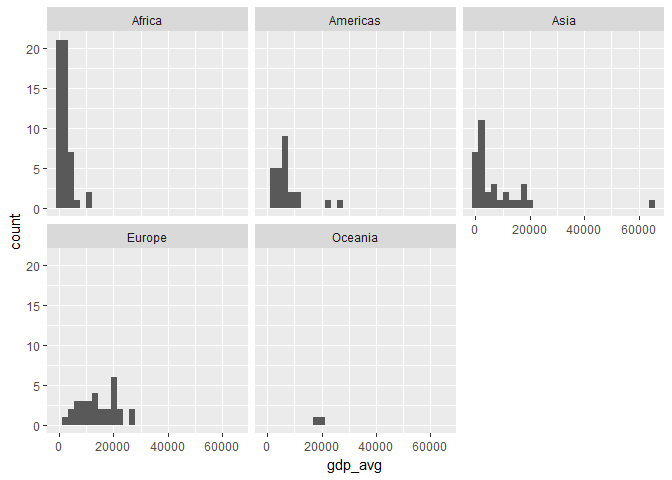

hw03\_gapminder.Rmd
================

Loading the libraries

``` r
library(gapminder)
library(tidyverse)
```

    ## Loading tidyverse: ggplot2
    ## Loading tidyverse: tibble
    ## Loading tidyverse: tidyr
    ## Loading tidyverse: readr
    ## Loading tidyverse: purrr
    ## Loading tidyverse: dplyr

    ## Conflicts with tidy packages ----------------------------------------------

    ## filter(): dplyr, stats
    ## lag():    dplyr, stats

``` r
library(knitr)
```

Query 1 : Get the maximum and minimum of GDP per capita for all continents Solution :

``` r
minmaxGDP<- gapminder %>%
  group_by(continent) %>%
  summarise(max_gdp = max(gdpPercap), min_gdp = min(gdpPercap))
kable(minmaxGDP)
```

| continent |   max\_gdp|    min\_gdp|
|:----------|----------:|-----------:|
| Africa    |   21951.21|    241.1659|
| Americas  |   42951.65|   1201.6372|
| Asia      |  113523.13|    331.0000|
| Europe    |   49357.19|    973.5332|
| Oceania   |   34435.37|  10039.5956|

``` r
ggplot(minmaxGDP, aes(x=continent)) +
  geom_point(aes(y=min_gdp), colour = "red") +
  geom_point(aes(y=max_gdp), colour = "cyan") +
  labs(y = "GDP per Cap") 
```


Query 2 : Look at the spread of GDP per capita within the continents. Solution :

``` r
spread <- gapminder %>%
  group_by(country,continent) %>%
  summarize(gdp_avg=mean(gdpPercap))
spread <- arrange(spread,continent)
knitr::kable(head(spread)) 
```

| country      | continent |   gdp\_avg|
|:-------------|:----------|----------:|
| Algeria      | Africa    |  4426.0260|
| Angola       | Africa    |  3607.1005|
| Benin        | Africa    |  1155.3951|
| Botswana     | Africa    |  5031.5036|
| Burkina Faso | Africa    |   843.9907|
| Burundi      | Africa    |   471.6630|

``` r
ggplot(spread,aes(x=gdp_avg))  + facet_wrap(~ continent) + geom_histogram()
```

    ## `stat_bin()` using `bins = 30`. Pick better value with `binwidth`.


