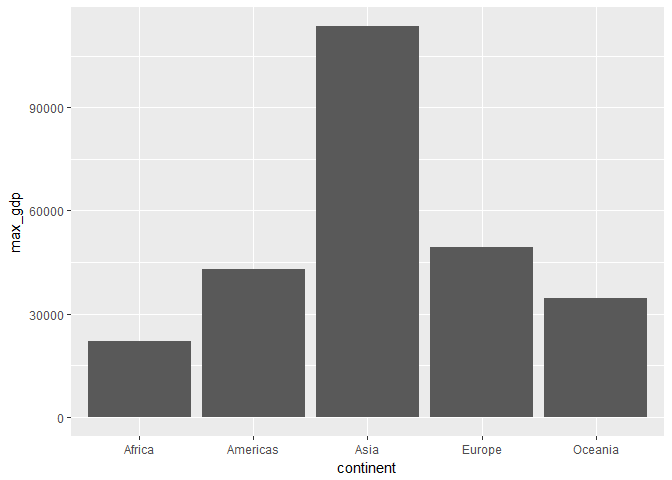
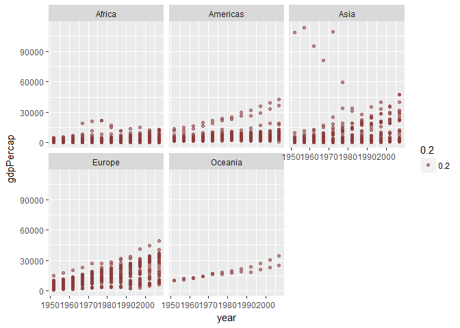

hw03\_gapminder.Rmd
================

Loading the libraries

``` r
library(gapminder)
library(tidyverse)
```

    ## Loading tidyverse: ggplot2
    ## Loading tidyverse: tibble
    ## Loading tidyverse: tidyr
    ## Loading tidyverse: readr
    ## Loading tidyverse: purrr
    ## Loading tidyverse: dplyr

    ## Conflicts with tidy packages ----------------------------------------------

    ## filter(): dplyr, stats
    ## lag():    dplyr, stats

``` r
library(knitr)
```

#### Query 1 : Get the maximum and minimum of GDP per capita for all continents

Solution :

``` r
minmaxGDP<- gapminder %>%
  group_by(continent) %>%
  summarise(max_gdp = max(gdpPercap), min_gdp = min(gdpPercap))
kable(minmaxGDP)
```

| continent |   max\_gdp|    min\_gdp|
|:----------|----------:|-----------:|
| Africa    |   21951.21|    241.1659|
| Americas  |   42951.65|   1201.6372|
| Asia      |  113523.13|    331.0000|
| Europe    |   49357.19|    973.5332|
| Oceania   |   34435.37|  10039.5956|

``` r
ggplot(minmaxGDP,aes(x=continent,y=max_gdp)) + geom_bar(stat="identity")
```



``` r
ggplot(minmaxGDP,aes(x=continent,y=min_gdp)) + geom_bar(stat="identity")
```


#### Query 2 : Look at the spread of GDP per capita within the continents.

Solution :

``` r
spread <- gapminder %>%
  group_by(continent) %>% 
  summarize(mean_gdp = mean(gdpPercap), 
            sd_gdp = sd(gdpPercap), 
            max_gdp = max(gdpPercap),
            min_gdp = min(gdpPercap))
kable(spread) 
```

| continent    |     mean\_gdp|       sd\_gdp|    max\_gdp|               min\_gdp|
|:-------------|-------------:|-------------:|-----------:|----------------------:|
| Africa       |      2193.755|      2827.930|    21951.21|               241.1659|
| Americas     |      7136.110|      6396.764|    42951.65|              1201.6372|
| Asia         |      7902.150|     14045.373|   113523.13|               331.0000|
| Europe       |     14469.476|      9355.213|    49357.19|               973.5332|
| Oceania      |     18621.609|      6358.983|    34435.37|             10039.5956|
| A box plot s |  howing the s|  pread of GDP|  per capita|  within the continents|

``` r
ggplot(gapminder, aes(continent, gdpPercap)) +
  geom_boxplot(aes(color=continent))
```


Mean value for gdpPerCap for each country over all years is calculated and a histogram is plotted to indicate the gdpPercap ,continentwise.

``` r
spread <- gapminder %>%
  group_by(country,continent) %>%
  summarize(gdpAverage=mean(gdpPercap))
spread <- arrange(spread,continent)

knitr::kable((spread)) 
```

| country                  | continent |  gdpAverage|
|:-------------------------|:----------|-----------:|
| Algeria                  | Africa    |   4426.0260|
| Angola                   | Africa    |   3607.1005|
| Benin                    | Africa    |   1155.3951|
| Botswana                 | Africa    |   5031.5036|
| Burkina Faso             | Africa    |    843.9907|
| Burundi                  | Africa    |    471.6630|
| Cameroon                 | Africa    |   1774.6342|
| Central African Republic | Africa    |    958.7847|
| Chad                     | Africa    |   1165.4537|
| Comoros                  | Africa    |   1314.3803|
| Congo, Dem. Rep.         | Africa    |    648.3426|
| Congo, Rep.              | Africa    |   3312.7882|
| Cote d'Ivoire            | Africa    |   1912.8254|
| Djibouti                 | Africa    |   2697.8332|
| Egypt                    | Africa    |   3074.0307|
| Equatorial Guinea        | Africa    |   2469.1667|
| Eritrea                  | Africa    |    541.0025|
| Ethiopia                 | Africa    |    509.1152|
| Gabon                    | Africa    |  11529.8655|
| Gambia                   | Africa    |    680.1326|
| Ghana                    | Africa    |   1044.5820|
| Guinea                   | Africa    |    776.0673|
| Guinea-Bissau            | Africa    |    652.1572|
| Kenya                    | Africa    |   1200.4157|
| Lesotho                  | Africa    |    780.5534|
| Liberia                  | Africa    |    604.8141|
| Libya                    | Africa    |  12013.5792|
| Madagascar               | Africa    |   1335.5950|
| Malawi                   | Africa    |    575.4472|
| Mali                     | Africa    |    673.0931|
| Mauritania               | Africa    |   1356.6710|
| Mauritius                | Africa    |   4768.9422|
| Morocco                  | Africa    |   2447.9089|
| Mozambique               | Africa    |    542.2783|
| Namibia                  | Africa    |   3675.5821|
| Niger                    | Africa    |    781.0768|
| Nigeria                  | Africa    |   1488.3094|
| Reunion                  | Africa    |   4898.3984|
| Rwanda                   | Africa    |    675.6690|
| Sao Tome and Principe    | Africa    |   1382.7820|
| Senegal                  | Africa    |   1533.1217|
| Sierra Leone             | Africa    |   1072.8195|
| Somalia                  | Africa    |   1140.7933|
| South Africa             | Africa    |   7247.4311|
| Sudan                    | Africa    |   1835.0104|
| Swaziland                | Africa    |   3163.3524|
| Tanzania                 | Africa    |    849.2813|
| Togo                     | Africa    |   1153.8201|
| Tunisia                  | Africa    |   3477.2104|
| Uganda                   | Africa    |    810.3838|
| Zambia                   | Africa    |   1358.1994|
| Zimbabwe                 | Africa    |    635.8580|
| Argentina                | Americas  |   8955.5538|
| Bolivia                  | Americas  |   2961.2288|
| Brazil                   | Americas  |   5829.3167|
| Canada                   | Americas  |  22410.7463|
| Chile                    | Americas  |   6703.2891|
| Colombia                 | Americas  |   4195.3429|
| Costa Rica               | Americas  |   5448.6108|
| Cuba                     | Americas  |   6283.2587|
| Dominican Republic       | Americas  |   2844.8564|
| Ecuador                  | Americas  |   5733.6248|
| El Salvador              | Americas  |   4431.8466|
| Guatemala                | Americas  |   4015.4028|
| Haiti                    | Americas  |   1620.7393|
| Honduras                 | Americas  |   2834.4131|
| Jamaica                  | Americas  |   6197.6454|
| Mexico                   | Americas  |   7724.1127|
| Nicaragua                | Americas  |   3424.6558|
| Panama                   | Americas  |   5754.8272|
| Paraguay                 | Americas  |   3239.6068|
| Peru                     | Americas  |   5613.8441|
| Puerto Rico              | Americas  |  10863.1643|
| Trinidad and Tobago      | Americas  |   7866.8719|
| United States            | Americas  |  26261.1513|
| Uruguay                  | Americas  |   7100.1332|
| Venezuela                | Americas  |  10088.5163|
| Afghanistan              | Asia      |    802.6746|
| Bahrain                  | Asia      |  18077.6639|
| Bangladesh               | Asia      |    817.5588|
| Cambodia                 | Asia      |    675.3678|
| China                    | Asia      |   1488.3077|
| Hong Kong, China         | Asia      |  16228.7009|
| India                    | Asia      |   1057.2963|
| Indonesia                | Asia      |   1741.3654|
| Iran                     | Asia      |   7376.5829|
| Iraq                     | Asia      |   7811.8091|
| Israel                   | Asia      |  14160.9364|
| Japan                    | Asia      |  17750.8700|
| Jordan                   | Asia      |   3128.1208|
| Korea, Dem. Rep.         | Asia      |   2591.8526|
| Korea, Rep.              | Asia      |   8217.3185|
| Kuwait                   | Asia      |  65332.9105|
| Lebanon                  | Asia      |   7269.2162|
| Malaysia                 | Asia      |   5406.0382|
| Mongolia                 | Asia      |   1692.8046|
| Myanmar                  | Asia      |    439.3333|
| Nepal                    | Asia      |    782.7288|
| Oman                     | Asia      |  12138.5622|
| Pakistan                 | Asia      |   1439.2707|
| Philippines              | Asia      |   2174.7711|
| Saudi Arabia             | Asia      |  20261.7436|
| Singapore                | Asia      |  17425.3823|
| Sri Lanka                | Asia      |   1854.7311|
| Syria                    | Asia      |   3009.2880|
| Taiwan                   | Asia      |  10224.8072|
| Thailand                 | Asia      |   3045.9665|
| Vietnam                  | Asia      |   1017.7126|
| West Bank and Gaza       | Asia      |   3759.9968|
| Yemen, Rep.              | Asia      |   1569.2747|
| Albania                  | Europe    |   3255.3666|
| Austria                  | Europe    |  20411.9163|
| Belgium                  | Europe    |  19900.7581|
| Bosnia and Herzegovina   | Europe    |   3484.7791|
| Bulgaria                 | Europe    |   6384.0552|
| Croatia                  | Europe    |   9331.7123|
| Czech Republic           | Europe    |  13920.0114|
| Denmark                  | Europe    |  21671.8249|
| Finland                  | Europe    |  17473.7227|
| France                   | Europe    |  18833.5703|
| Germany                  | Europe    |  20556.6844|
| Greece                   | Europe    |  13969.0368|
| Hungary                  | Europe    |  10888.1757|
| Iceland                  | Europe    |  20531.4223|
| Ireland                  | Europe    |  15758.6062|
| Italy                    | Europe    |  16245.2090|
| Montenegro               | Europe    |   7208.0646|
| Netherlands              | Europe    |  21748.8522|
| Norway                   | Europe    |  26747.3066|
| Poland                   | Europe    |   8416.5539|
| Portugal                 | Europe    |  11354.0919|
| Romania                  | Europe    |   7300.1700|
| Serbia                   | Europe    |   9305.0494|
| Slovak Republic          | Europe    |  10415.5307|
| Slovenia                 | Europe    |  14074.5821|
| Spain                    | Europe    |  14029.8265|
| Sweden                   | Europe    |  19943.1261|
| Switzerland              | Europe    |  27074.3344|
| Turkey                   | Europe    |   4469.4534|
| United Kingdom           | Europe    |  19380.4730|
| Australia                | Oceania   |  19980.5956|
| New Zealand              | Oceania   |  17262.6228|

``` r
ggplot(spread,aes(x=gdpAverage,fill ="purple"))  + facet_wrap(~ continent) + geom_histogram(colour="cyan")
```

    ## `stat_bin()` using `bins = 30`. Pick better value with `binwidth`.


``` r
gapminder %>%
  group_by(continent) %>%
  ggplot(aes(year,gdpPercap,alpha=.2)) + 
  geom_point(size = 1.5, color = "indianred4") +
  facet_wrap(~continent)
```



#### Query 3 : Compute a trimmed mean of life expectancy for different years. Or a weighted mean, weighting by population. Just try something other than the plain vanilla mean.

Solution : Weighing Life Expectancy by population is tried below :

``` r
WeightedLifeExp <- gapminder %>% 
  group_by(year) %>% 
  summarize(WeightedLifeExpByPop = weighted.mean(lifeExp,pop))
knitr::kable(WeightedLifeExp)
```

|  year|  WeightedLifeExpByPop|
|-----:|---------------------:|
|  1952|              48.94424|
|  1957|              52.12189|
|  1962|              52.32438|
|  1967|              56.98431|
|  1972|              59.51478|
|  1977|              61.23726|
|  1982|              62.88176|
|  1987|              64.41635|
|  1992|              65.64590|
|  1997|              66.84934|
|  2002|              67.83904|
|  2007|              68.91909|

#### Query 4 How is life expectancy changing over time on different continents?

Solution :

``` r
ggplot(gapminder, aes(year, lifeExp)) +
    facet_wrap(~ continent) +
    geom_point()+ geom_smooth(se=F)
```

    ## `geom_smooth()` using method = 'loess'


Over the years,in general, life expectency has increased for all continents.Life expectency for the continents :Asia and Americas , shows an upward trend compared to those of Europe and Oceania show a gradual increase in Life Expectancy. While in Africa, there is gradual increase in LifeExpectancy from 1950 - 1985,but the same almost stabilises between the years post 1985.

#### Query 5 : Report the absolute and/or relative abundance of countries with low life expectancy over time by continent: Compute some measure of worldwide life expectancy – you decide – a mean or median or some other quantile or perhaps your current age. Then determine how many countries on each continent have a life expectancy less than this benchmark, for each year.

Solution :

``` r
Benchmark <- mean(gapminder$lifeExp)
life_threshold <-gapminder %>% 
  group_by(year,continent) %>% 
  mutate(size=c(1,0)[(lifeExp<Benchmark) + 1]) %>%
  mutate(size_con=c(1,0)[(lifeExp<0) + 1]) %>% 
  summarise(percentage = sum(size)/sum(size_con)*100) %>% 
  arrange(continent)
summary(life_threshold$percentage)
```

    ##    Min. 1st Qu.  Median    Mean 3rd Qu.    Max. 
    ##    0.00   26.44   86.67   67.80  100.00  100.00

``` r
knitr::kable((life_threshold))
```

|  year| continent |  percentage|
|-----:|:----------|-----------:|
|  1952| Africa    |    0.000000|
|  1957| Africa    |    0.000000|
|  1962| Africa    |    1.923077|
|  1967| Africa    |    3.846154|
|  1972| Africa    |    3.846154|
|  1977| Africa    |    5.769231|
|  1982| Africa    |   17.307692|
|  1987| Africa    |   25.000000|
|  1992| Africa    |   26.923077|
|  1997| Africa    |   25.000000|
|  2002| Africa    |   21.153846|
|  2007| Africa    |   23.076923|
|  1952| Americas  |   24.000000|
|  1957| Americas  |   40.000000|
|  1962| Americas  |   48.000000|
|  1967| Americas  |   60.000000|
|  1972| Americas  |   68.000000|
|  1977| Americas  |   72.000000|
|  1982| Americas  |   80.000000|
|  1987| Americas  |   92.000000|
|  1992| Americas  |   96.000000|
|  1997| Americas  |   96.000000|
|  2002| Americas  |   96.000000|
|  2007| Americas  |  100.000000|
|  1952| Asia      |   12.121212|
|  1957| Asia      |   21.212121|
|  1962| Asia      |   24.242424|
|  1967| Asia      |   30.303030|
|  1972| Asia      |   42.424242|
|  1977| Asia      |   57.575758|
|  1982| Asia      |   66.666667|
|  1987| Asia      |   75.757576|
|  1992| Asia      |   78.787879|
|  1997| Asia      |   81.818182|
|  2002| Asia      |   90.909091|
|  2007| Asia      |   96.969697|
|  1952| Europe    |   83.333333|
|  1957| Europe    |   90.000000|
|  1962| Europe    |   96.666667|
|  1967| Europe    |   96.666667|
|  1972| Europe    |   96.666667|
|  1977| Europe    |  100.000000|
|  1982| Europe    |  100.000000|
|  1987| Europe    |  100.000000|
|  1992| Europe    |  100.000000|
|  1997| Europe    |  100.000000|
|  2002| Europe    |  100.000000|
|  2007| Europe    |  100.000000|
|  1952| Oceania   |  100.000000|
|  1957| Oceania   |  100.000000|
|  1962| Oceania   |  100.000000|
|  1967| Oceania   |  100.000000|
|  1972| Oceania   |  100.000000|
|  1977| Oceania   |  100.000000|
|  1982| Oceania   |  100.000000|
|  1987| Oceania   |  100.000000|
|  1992| Oceania   |  100.000000|
|  1997| Oceania   |  100.000000|
|  2002| Oceania   |  100.000000|
|  2007| Oceania   |  100.000000|

``` r
ggplot(life_threshold,aes(year,percentage,color=continent)) + geom_line()
```


#### Query 6: Find countries with interesting stories. Open-ended and, therefore, hard. Promising but unsuccessful attempts are encouraged. This will generate interesting questions to follow up on in class.

Solution : Countries Selected : India and China

``` r
India_China <- gapminder %>%
  filter(country %in% c("India", "China")) # filtering for only India and China


India_China %>%
  ggplot(aes(x = year))+
  geom_line(aes(y = pop), colour = "orange") +
  geom_line(aes(y = lifeExp), colour = "indianred4") +
  scale_y_continuous(sec.axis = sec_axis(~.*1, name = "LifeExpectancy")) +
  facet_wrap(~country)# plotting graphs to compare pop and GDP
```


India and China show an upward trend for Population growth,while the LifeExpectancy stagnates.

``` r
# filtering for only India and China
India_China <- gapminder %>%
  filter(country %in% c("India", "China")) 

# plotting using 2 different y axis in order to compare pop and GDP
India_China %>%
  ggplot(aes(x = year))+
  geom_line(aes(y = gdpPercap), colour = "orange") +
  geom_line(aes(y = pop), colour = "indianred4") +
  scale_y_continuous(sec.axis = sec_axis(~.*1, name = "Population")) +
  facet_wrap(~country)
```


In the above graph aswell,India and China show an upward trend for Population growth,while the GdpPer captica stagnates.
