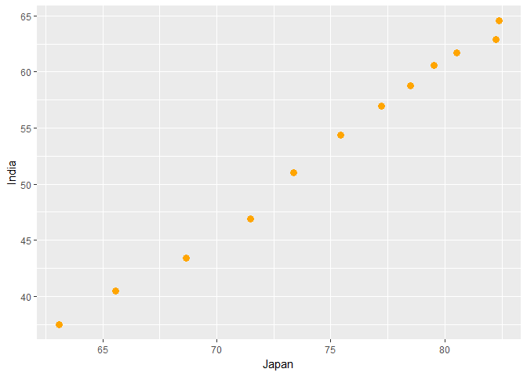
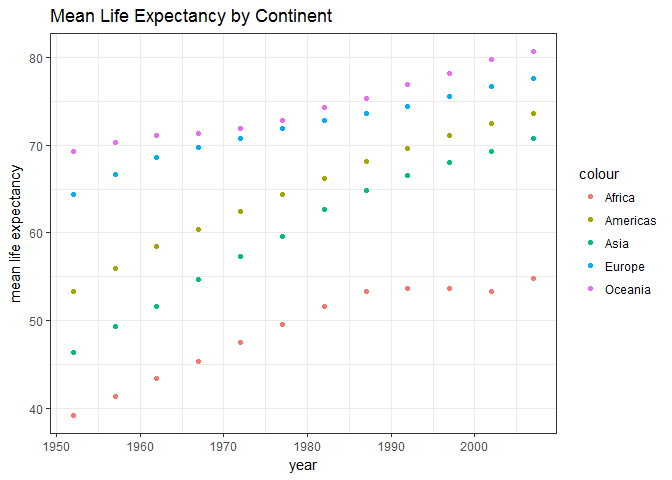

homework04\_dataReshaping
================

``` r
library(gapminder)
library(tidyverse)
```

    ## Loading tidyverse: ggplot2
    ## Loading tidyverse: tibble
    ## Loading tidyverse: tidyr
    ## Loading tidyverse: readr
    ## Loading tidyverse: purrr
    ## Loading tidyverse: dplyr

    ## Conflicts with tidy packages ----------------------------------------------

    ## filter(): dplyr, stats
    ## lag():    dplyr, stats

``` r
library(reshape2)
```

    ## 
    ## Attaching package: 'reshape2'

    ## The following object is masked from 'package:tidyr':
    ## 
    ##     smiths

### General data reshaping and relationship to aggregation

Activity \#1

1.Make you own cheatsheet similar to Tyler Rinker’s minimal guide to tidyr. Reshape your data. For simple reshaping, gather() and spread() from tidyr will suffice. Do the thing that it possible / easier now that your data has a new shape.

Solution : I would explore the below functions : \* Gather \* Spread \* dcast

I found the examples discussed in class very usefula nd would use the same as my cheetsheet to tidyr

``` r
library(devtools)
install_github("JoeyBernhardt/singer")
```

    ## Skipping install of 'singer' from a github remote, the SHA1 (2b4fe9cb) has not changed since last install.
    ##   Use `force = TRUE` to force installation

Now we have the singer dataframes contain songs and location

``` r
library(singer)
```

and then we load into the environement the datasets

``` r
data("locations")
data("songs")
```

Gather :

Gather function converts the data frame longer instead of wider.In the below example we select the columns depicting :

year,artist\_hotness,artist\_familiarity and duration

``` r
hfd_y <-singer_locations %>% 
  select(year,artist_hotttnesss,artist_familiarity,duration)
hfd_y
```

    ## # A tibble: 10,100 x 4
    ##     year artist_hotttnesss artist_familiarity duration
    ##    <int>             <dbl>              <dbl>    <dbl>
    ##  1  2007         0.6410183          0.8230522 170.4485
    ##  2  2004         0.3937627          0.5700167 106.5530
    ##  3  1998         0.4306226          0.5039940 527.5947
    ##  4  1995         0.3622792          0.4773099 695.1179
    ##  5  1968         0.4107520          0.5303468 237.3220
    ##  6  2006         0.3762635          0.5412950 192.9400
    ##  7  2003         0.1814601          0.2744329 239.5424
    ##  8  2007         0.4743547          0.6979295 222.8502
    ##  9  1966         0.5103250          0.7964934 177.9718
    ## 10  2006         0.4196401          0.5931096 259.8395
    ## # ... with 10,090 more rows

``` r
hfd_y_long <-hfd_y %>% 
  gather(key = "Measure",value ="Units", artist_hotttnesss:duration)
hfd_y_long
```

    ## # A tibble: 30,300 x 3
    ##     year           Measure     Units
    ##    <int>             <chr>     <dbl>
    ##  1  2007 artist_hotttnesss 0.6410183
    ##  2  2004 artist_hotttnesss 0.3937627
    ##  3  1998 artist_hotttnesss 0.4306226
    ##  4  1995 artist_hotttnesss 0.3622792
    ##  5  1968 artist_hotttnesss 0.4107520
    ##  6  2006 artist_hotttnesss 0.3762635
    ##  7  2003 artist_hotttnesss 0.1814601
    ##  8  2007 artist_hotttnesss 0.4743547
    ##  9  1966 artist_hotttnesss 0.5103250
    ## 10  2006 artist_hotttnesss 0.4196401
    ## # ... with 30,290 more rows

SPREAD:

We use spread for wider distribution of data. Columns indicate the data that aids in spreading.

``` r
hfd_y<-singer_locations %>% 
  select(year,song_id,duration:artist_familiarity) %>% 
  gather(key ="Measures",value ="My_value",duration:artist_familiarity)
```

``` r
spread(hfd_y,Measures,My_value,fill=NA,drop = TRUE,sep=NULL)
```

    ## # A tibble: 10,100 x 5
    ##     year            song_id artist_familiarity artist_hotttnesss  duration
    ##  * <int>              <chr>              <dbl>             <dbl>     <dbl>
    ##  1     0 SOACFPP12AB0187247          0.4672135         0.0000000 216.21506
    ##  2     0 SOANGKW12AB0182CEB          0.4438926         0.0000000 110.00118
    ##  3     0 SOAOTUC12AB01868D9          0.7512330         0.5262221 233.09016
    ##  4     0 SOAZFOU12A58A79370          0.4421961         0.3847638 341.36771
    ##  5     0 SOBYVWR12A8C13A0E3          0.5658205         0.3782636 233.22077
    ##  6     0 SODYVFI12A58A81CE5          0.4872071         0.3339409 257.59302
    ##  7     0 SOEBEPI12AB01837EF          0.0000000         0.3750991 218.27873
    ##  8     0 SOEIMZR12AB01876A4          0.6190077         0.4409915  99.89179
    ##  9     0 SOELHNO12A8C13F09F          0.3963041         0.0000000 228.33587
    ## 10     0 SOENBSB12A8C13DEE4          0.4928908         0.3987057 327.49669
    ## # ... with 10,090 more rows

DCAST :

In this example the function : Dcast (), populates each row with the corresponding mean for particular column variables.

``` r
hfd_y_mean<- hfd_y %>% 
  reshape2::dcast(year ~ Measures,value.var = "My_value",
                     fun.aggregate = mean,na.rm = TRUE)
hfd_y_mean
```

    ##    year artist_familiarity artist_hotttnesss duration
    ## 1     0          0.5052371         0.3239388 240.1991
    ## 2  1922          0.4891340         0.3496206 180.4012
    ## 3  1926          0.5948666         0.3828469 172.8257
    ## 4  1927          0.5948666         0.3828469 195.9702
    ## 5  1929          0.5061268         0.3507879 170.9710
    ## 6  1937          0.5190001         0.3530357 181.7857
    ## 7  1940          0.5012381         0.3568980 194.9775
    ## 8  1945          0.3646056         0.4688427 137.6387
    ## 9  1947          0.4258833         0.3136478 181.0804
    ## 10 1948          0.6499450         0.4419084 190.3016
    ## 11 1951          0.5825867         0.4216157 167.9408
    ## 12 1952          0.6503980         0.4358152 165.1718
    ## 13 1953          0.5942116         0.3951581 123.1756
    ## 14 1954          0.7512638         0.5491553 182.9002
    ## 15 1955          0.5507106         0.3981285 232.0453
    ## 16 1956          0.5965135         0.4384135 181.9633
    ## 17 1957          0.5757590         0.4079749 214.6303
    ## 18 1958          0.6442515         0.4223344 239.5228
    ## 19 1959          0.6194515         0.4355119 176.9791
    ## 20 1960          0.5916395         0.4066395 213.2806
    ## 21 1961          0.5577460         0.3961865 173.3762
    ## 22 1962          0.5790061         0.4146647 240.8712
    ## 23 1963          0.5870445         0.4085145 160.7105
    ## 24 1964          0.5746336         0.3683188 182.5898
    ## 25 1965          0.6066903         0.4083368 218.1328
    ## 26 1966          0.6367878         0.4237375 169.1816
    ## 27 1967          0.6203433         0.4490179 170.0589
    ## 28 1968          0.6100990         0.4303272 186.0353
    ## 29 1969          0.6240159         0.4357142 198.1069
    ## 30 1970          0.6300334         0.4473265 276.4579
    ## 31 1971          0.6217453         0.4463278 231.1737
    ## 32 1972          0.5917494         0.4222272 292.6662
    ## 33 1973          0.5895343         0.4204878 290.2804
    ## 34 1974          0.6195374         0.4305658 220.5718
    ## 35 1975          0.6040239         0.4122132 244.3799
    ## 36 1976          0.6178990         0.4249131 277.7451
    ## 37 1977          0.6254185         0.4286107 258.2891
    ## 38 1978          0.6196770         0.4492856 221.8575
    ## 39 1979          0.6029274         0.4173256 262.6671
    ## 40 1980          0.6108205         0.4292917 235.9252
    ## 41 1981          0.6139829         0.4438614 227.0903
    ## 42 1982          0.6027000         0.4060857 237.9836
    ## 43 1983          0.6279947         0.4400708 242.7893
    ## 44 1984          0.6170992         0.4427675 261.4660
    ## 45 1985          0.6068504         0.4277469 260.7566
    ## 46 1986          0.6074905         0.4330136 243.6317
    ## 47 1987          0.6177712         0.4442072 256.1722
    ## 48 1988          0.5926340         0.4196773 238.2824
    ## 49 1989          0.5907609         0.4119238 257.2638
    ## 50 1990          0.5764988         0.4088248 240.4475
    ## 51 1991          0.5756165         0.4022150 247.6053
    ## 52 1992          0.5762538         0.4019781 243.5632
    ## 53 1993          0.5706703         0.3887713 241.2611
    ## 54 1994          0.5769310         0.4015449 251.2840
    ## 55 1995          0.5800948         0.4068184 243.3836
    ## 56 1996          0.5786344         0.4030835 244.1976
    ## 57 1997          0.5876600         0.3933718 247.7938
    ## 58 1998          0.5821633         0.4095104 260.0710
    ## 59 1999          0.5931064         0.4147859 254.1444
    ## 60 2000          0.5943571         0.4120225 260.3667
    ## 61 2001          0.5847773         0.3958336 261.7468
    ## 62 2002          0.5812809         0.4059217 257.5316
    ## 63 2003          0.6072930         0.4201097 243.3904
    ## 64 2004          0.6001547         0.4171090 239.3157
    ## 65 2005          0.5983023         0.4107221 246.3510
    ## 66 2006          0.5986434         0.4083919 246.5558
    ## 67 2007          0.6134667         0.4177400 254.8794
    ## 68 2008          0.6114963         0.4253368 258.8586
    ## 69 2009          0.6190572         0.4426654 245.9941
    ## 70 2010          0.6257959         0.4571736 257.6905

Activity \#2

2.Make a tibble with one row per year and columns for life expectancy for two or more countries. Use knitr::kable() to make this table look pretty in your rendered homework. Take advantage of this new data shape to scatterplot life expectancy for one country against that of another.

Solution:

Steps followed were :

    * Filter() is used on countried to pop-out 3 countries ,i.e.., Japan India and United States
    * Select() is used to filter out the columns : country, year and lifeExp
    * Use spread to get country against each year.The value dispalyed within Country indicates the Life Expectancy
    * ggplot () is used to plot lifeExp of India against Japan 
    * The scatter plot indicates that Life Expectancy of Japan is better than India

``` r
LifeExp <- gapminder %>%
  filter(country %in% c("Japan", "India", "United States")) %>% 
  select(country, year, lifeExp) %>% 
  spread(country, lifeExp)

  knitr::kable(LifeExp,align = "c", format = "markdown", digits = 4)
```

| year |  India |  Japan | United States |
|:----:|:------:|:------:|:-------------:|
| 1952 | 37.373 | 63.030 |     68.440    |
| 1957 | 40.249 | 65.500 |     69.490    |
| 1962 | 43.605 | 68.730 |     70.210    |
| 1967 | 47.193 | 71.430 |     70.760    |
| 1972 | 50.651 | 73.420 |     71.340    |
| 1977 | 54.208 | 75.380 |     73.380    |
| 1982 | 56.596 | 77.110 |     74.650    |
| 1987 | 58.553 | 78.670 |     75.020    |
| 1992 | 60.223 | 79.360 |     76.090    |
| 1997 | 61.765 | 80.690 |     76.810    |
| 2002 | 62.879 | 82.000 |     77.310    |
| 2007 | 64.698 | 82.603 |     78.242    |

``` r
ggplot(LifeExp)+
  geom_jitter(aes(x = Japan, y = India), size = 3, colour = "orange") 
```



``` r
  labs(title = "Life Expectancy of Japan vs. India") +
  theme_bw()
```

    ## NULL

Activity \#3

3.Compute some measure of life expectancy (mean? median? min? max?) for all possible combinations of continent and year. Reshape that to have one row per year and one variable for each continent. Or the other way around: one row per continent and one variable per year. Use knitr::kable() to make these tables look pretty in your rendered homework. Is there a plot that is easier to make with the data in this shape versis the usual form? If so (or you think so), try it! Reflect.

Solution :

Steps that I followed are :

    * group_by()is used to filter out variables: Continent and Year
    * Mean Life Expectancy per year is calculated for each Continent
    * spread() is used to display mean life expectancy for each continent for particular year
    * Knitr Kable () is used for creating a table

``` r
MeanLifeExpContinent <- gapminder %>% 
  group_by(continent,year) %>% 
  summarize(meanlifeExp=mean(lifeExp))
MeanLifeExpSpread <- MeanLifeExpContinent %>%
  spread(key = continent,value = meanlifeExp)
knitr::kable(MeanLifeExpSpread,align = "c", format = "markdown", digits = 4)
```

| year |  Africa | Americas |   Asia  |  Europe | Oceania |
|:----:|:-------:|:--------:|:-------:|:-------:|:-------:|
| 1952 | 39.1355 |  53.2798 | 46.3144 | 64.4085 | 69.2550 |
| 1957 | 41.2663 |  55.9603 | 49.3185 | 66.7031 | 70.2950 |
| 1962 | 43.3194 |  58.3988 | 51.5632 | 68.5392 | 71.0850 |
| 1967 | 45.3345 |  60.4109 | 54.6636 | 69.7376 | 71.3100 |
| 1972 | 47.4509 |  62.3949 | 57.3193 | 70.7750 | 71.9100 |
| 1977 | 49.5804 |  64.3916 | 59.6106 | 71.9378 | 72.8550 |
| 1982 | 51.5929 |  66.2288 | 62.6179 | 72.8064 | 74.2900 |
| 1987 | 53.3448 |  68.0907 | 64.8512 | 73.6422 | 75.3200 |
| 1992 | 53.6296 |  69.5684 | 66.5372 | 74.4401 | 76.9450 |
| 1997 | 53.5983 |  71.1505 | 68.0205 | 75.5052 | 78.1900 |
| 2002 | 53.3252 |  72.4220 | 69.2339 | 76.7006 | 79.7400 |
| 2007 | 54.8060 |  73.6081 | 70.7285 | 77.6486 | 80.7195 |

Activity \#4

4.In Window functions, we formed a tibble with 24 rows: 2 per year, giving the country with both the lowest and highest life expectancy (in Asia). Take that table (or a similar one for all continents) and reshape it so you have one row per year or per year continent combination. Solution :

    * Grouped the data by year and continent
    * Filtered the data to get mean lifeExp country for each continent per year
    * use spread() so that the continent and meanLE data so as to form columns containing year and different continents
    * Plot mean life expectancy by year by continent 

``` r
continentLifeExp <- gapminder %>%
  group_by(continent, year) %>% 
  summarize(meanLE=mean(lifeExp))
continentLifeExp
```

    ## # A tibble: 60 x 3
    ## # Groups:   continent [?]
    ##    continent  year   meanLE
    ##       <fctr> <int>    <dbl>
    ##  1    Africa  1952 39.13550
    ##  2    Africa  1957 41.26635
    ##  3    Africa  1962 43.31944
    ##  4    Africa  1967 45.33454
    ##  5    Africa  1972 47.45094
    ##  6    Africa  1977 49.58042
    ##  7    Africa  1982 51.59287
    ##  8    Africa  1987 53.34479
    ##  9    Africa  1992 53.62958
    ## 10    Africa  1997 53.59827
    ## # ... with 50 more rows

``` r
continentLifeExp %>% 
  spread(continent, meanLE) %>% 
   knitr::kable()
```

|  year|    Africa|  Americas|      Asia|    Europe|  Oceania|
|-----:|---------:|---------:|---------:|---------:|--------:|
|  1952|  39.13550|  53.27984|  46.31439|  64.40850|  69.2550|
|  1957|  41.26635|  55.96028|  49.31854|  66.70307|  70.2950|
|  1962|  43.31944|  58.39876|  51.56322|  68.53923|  71.0850|
|  1967|  45.33454|  60.41092|  54.66364|  69.73760|  71.3100|
|  1972|  47.45094|  62.39492|  57.31927|  70.77503|  71.9100|
|  1977|  49.58042|  64.39156|  59.61056|  71.93777|  72.8550|
|  1982|  51.59287|  66.22884|  62.61794|  72.80640|  74.2900|
|  1987|  53.34479|  68.09072|  64.85118|  73.64217|  75.3200|
|  1992|  53.62958|  69.56836|  66.53721|  74.44010|  76.9450|
|  1997|  53.59827|  71.15048|  68.02052|  75.50517|  78.1900|
|  2002|  53.32523|  72.42204|  69.23388|  76.70060|  79.7400|
|  2007|  54.80604|  73.60812|  70.72848|  77.64860|  80.7195|

``` r
continentLifeExp
```

    ## # A tibble: 60 x 3
    ## # Groups:   continent [?]
    ##    continent  year   meanLE
    ##       <fctr> <int>    <dbl>
    ##  1    Africa  1952 39.13550
    ##  2    Africa  1957 41.26635
    ##  3    Africa  1962 43.31944
    ##  4    Africa  1967 45.33454
    ##  5    Africa  1972 47.45094
    ##  6    Africa  1977 49.58042
    ##  7    Africa  1982 51.59287
    ##  8    Africa  1987 53.34479
    ##  9    Africa  1992 53.62958
    ## 10    Africa  1997 53.59827
    ## # ... with 50 more rows

``` r
continentLifeExp %>% 
  spread(continent, meanLE) %>% 
  ggplot(aes(year)) +
  geom_point(aes(y=Africa, colour="Africa"))+
  geom_point(aes(y=Americas, colour="Americas"))+
  geom_point(aes(y=Asia, colour="Asia"))+
  geom_point(aes(y=Europe, colour="Europe"))+
  geom_point(aes(y=Oceania, colour="Oceania"))+
  labs(y="mean life expectancy", title= "Mean Life Expectancy by Continent")+
  theme_bw()
```



Activity \#5

6.Previous TA Andrew MacDonald has a nice data manipulation sampler. Make up a similar set of exercises for yourself, in the abstract or (even better) using Gapminder or other data, and solve them. Solution :

### Join, merge, look up

#### Create a second data frame, complementary to Gapminder. Join this with (part of) Gapminder using a dplyr join function and make some observations about the process and result. Explore the different types of joins.

Solution:

Created second data frame with Country and its Capital City.

``` r
country_capitals <- data.frame(country=c("Australia","Austria","Belgium","China", "Italy", "Croatia", "Egypt", "Greece", "India"), capital=c("CANBERRA","VIENNA","BRUSSELS","BEIJING","ROME","ZAGREB","CAIRO","ATHENS","NEW DELHI"))
knitr::kable(country_capitals)
```

| country   | capital   |
|:----------|:----------|
| Australia | CANBERRA  |
| Austria   | VIENNA    |
| Belgium   | BRUSSELS  |
| China     | BEIJING   |
| Italy     | ROME      |
| Croatia   | ZAGREB    |
| Egypt     | CAIRO     |
| Greece    | ATHENS    |
| India     | NEW DELHI |

``` r
gapminder
```

    ## # A tibble: 1,704 x 6
    ##        country continent  year lifeExp      pop gdpPercap
    ##         <fctr>    <fctr> <int>   <dbl>    <int>     <dbl>
    ##  1 Afghanistan      Asia  1952  28.801  8425333  779.4453
    ##  2 Afghanistan      Asia  1957  30.332  9240934  820.8530
    ##  3 Afghanistan      Asia  1962  31.997 10267083  853.1007
    ##  4 Afghanistan      Asia  1967  34.020 11537966  836.1971
    ##  5 Afghanistan      Asia  1972  36.088 13079460  739.9811
    ##  6 Afghanistan      Asia  1977  38.438 14880372  786.1134
    ##  7 Afghanistan      Asia  1982  39.854 12881816  978.0114
    ##  8 Afghanistan      Asia  1987  40.822 13867957  852.3959
    ##  9 Afghanistan      Asia  1992  41.674 16317921  649.3414
    ## 10 Afghanistan      Asia  1997  41.763 22227415  635.3414
    ## # ... with 1,694 more rows

##### Left Join

left\_join() : Retains the column country in gapminder dataset and appends the capital city(New data) as a new column into the gampminder dataset. left\_join returns data from the second data frame aswell.Please note Column 7 in the below table (i.e. capital city)

``` r
Left_Join <-left_join(gapminder,country_capitals ,by = "country")
```

    ## Warning: Column `country` joining factors with different levels, coercing
    ## to character vector

``` r
Left_Join %>% filter(country %in% c("Australia","Austria","Belgium","China", "Italy", "Croatia", "Egypt", "Greece", "India"))
```

    ## # A tibble: 108 x 7
    ##      country continent  year lifeExp      pop gdpPercap  capital
    ##        <chr>    <fctr> <int>   <dbl>    <int>     <dbl>   <fctr>
    ##  1 Australia   Oceania  1952   69.12  8691212  10039.60 CANBERRA
    ##  2 Australia   Oceania  1957   70.33  9712569  10949.65 CANBERRA
    ##  3 Australia   Oceania  1962   70.93 10794968  12217.23 CANBERRA
    ##  4 Australia   Oceania  1967   71.10 11872264  14526.12 CANBERRA
    ##  5 Australia   Oceania  1972   71.93 13177000  16788.63 CANBERRA
    ##  6 Australia   Oceania  1977   73.49 14074100  18334.20 CANBERRA
    ##  7 Australia   Oceania  1982   74.74 15184200  19477.01 CANBERRA
    ##  8 Australia   Oceania  1987   76.32 16257249  21888.89 CANBERRA
    ##  9 Australia   Oceania  1992   77.56 17481977  23424.77 CANBERRA
    ## 10 Australia   Oceania  1997   78.83 18565243  26997.94 CANBERRA
    ## # ... with 98 more rows

##### Anti Join

anti\_join() : Retains the coutries that are present in gapminder dataset but not in the second data set. And hence in the below example it only displays 1,596 rows(i.e Gapminder (1704 rows) - Second data set(108 rows)) anti\_join does not contain return any column of the second data set.

``` r
Anti_join<-anti_join(gapminder,country_capitals)
```

    ## Joining, by = "country"

    ## Warning: Column `country` joining factors with different levels, coercing
    ## to character vector

``` r
Anti_join
```

    ## # A tibble: 1,596 x 6
    ##        country continent  year lifeExp      pop gdpPercap
    ##         <fctr>    <fctr> <int>   <dbl>    <int>     <dbl>
    ##  1 Afghanistan      Asia  1952  28.801  8425333  779.4453
    ##  2 Afghanistan      Asia  1957  30.332  9240934  820.8530
    ##  3 Afghanistan      Asia  1962  31.997 10267083  853.1007
    ##  4 Afghanistan      Asia  1967  34.020 11537966  836.1971
    ##  5 Afghanistan      Asia  1972  36.088 13079460  739.9811
    ##  6 Afghanistan      Asia  1977  38.438 14880372  786.1134
    ##  7 Afghanistan      Asia  1982  39.854 12881816  978.0114
    ##  8 Afghanistan      Asia  1987  40.822 13867957  852.3959
    ##  9 Afghanistan      Asia  1992  41.674 16317921  649.3414
    ## 10 Afghanistan      Asia  1997  41.763 22227415  635.3414
    ## # ... with 1,586 more rows

##### Semi Join

Semi\_join() : Retains the countries that are common in both gapminder dataset and in the second data set.However,it does not return the column present in second data frame,hence the below table contains 6 columns only.

``` r
Semi_join<-semi_join(gapminder,country_capitals)
```

    ## Joining, by = "country"

    ## Warning: Column `country` joining factors with different levels, coercing
    ## to character vector

``` r
Semi_join %>% filter(country %in% c("Australia","Austria","Belgium","China", "Italy", "Croatia", "Egypt", "Greece", "India"))
```

    ## # A tibble: 108 x 6
    ##      country continent  year lifeExp      pop gdpPercap
    ##       <fctr>    <fctr> <int>   <dbl>    <int>     <dbl>
    ##  1 Australia   Oceania  1952   69.12  8691212  10039.60
    ##  2 Australia   Oceania  1957   70.33  9712569  10949.65
    ##  3 Australia   Oceania  1962   70.93 10794968  12217.23
    ##  4 Australia   Oceania  1967   71.10 11872264  14526.12
    ##  5 Australia   Oceania  1972   71.93 13177000  16788.63
    ##  6 Australia   Oceania  1977   73.49 14074100  18334.20
    ##  7 Australia   Oceania  1982   74.74 15184200  19477.01
    ##  8 Australia   Oceania  1987   76.32 16257249  21888.89
    ##  9 Australia   Oceania  1992   77.56 17481977  23424.77
    ## 10 Australia   Oceania  1997   78.83 18565243  26997.94
    ## # ... with 98 more rows

##### Full Join

Full\_join() :Retains the countries from both gapminder and the second data set and appends additional information against each country.Updates unavailable data as NA in the last column(i.e..,column 7)

``` r
Full_join <-full_join(gapminder,country_capitals)
```

    ## Joining, by = "country"

    ## Warning: Column `country` joining factors with different levels, coercing
    ## to character vector

``` r
Full_join %>% filter(country %in% c("Australia","Austria","Belgium","China", "Italy", "Croatia", "Egypt", "Greece", "India"))
```

    ## # A tibble: 108 x 7
    ##      country continent  year lifeExp      pop gdpPercap  capital
    ##        <chr>    <fctr> <int>   <dbl>    <int>     <dbl>   <fctr>
    ##  1 Australia   Oceania  1952   69.12  8691212  10039.60 CANBERRA
    ##  2 Australia   Oceania  1957   70.33  9712569  10949.65 CANBERRA
    ##  3 Australia   Oceania  1962   70.93 10794968  12217.23 CANBERRA
    ##  4 Australia   Oceania  1967   71.10 11872264  14526.12 CANBERRA
    ##  5 Australia   Oceania  1972   71.93 13177000  16788.63 CANBERRA
    ##  6 Australia   Oceania  1977   73.49 14074100  18334.20 CANBERRA
    ##  7 Australia   Oceania  1982   74.74 15184200  19477.01 CANBERRA
    ##  8 Australia   Oceania  1987   76.32 16257249  21888.89 CANBERRA
    ##  9 Australia   Oceania  1992   77.56 17481977  23424.77 CANBERRA
    ## 10 Australia   Oceania  1997   78.83 18565243  26997.94 CANBERRA
    ## # ... with 98 more rows

##### Inner Join

Inner\_join() :Retains the countries that are common to both gapminder dataset and the second data set and also, appends a new column for new information against each country.

``` r
Inner_join <-inner_join(gapminder,country_capitals)
```

    ## Joining, by = "country"

    ## Warning: Column `country` joining factors with different levels, coercing
    ## to character vector

``` r
Inner_join %>% filter(country %in% c("Australia","Austria","Belgium","China", "Italy", "Croatia", "Egypt", "Greece", "India"))
```

    ## # A tibble: 108 x 7
    ##      country continent  year lifeExp      pop gdpPercap  capital
    ##        <chr>    <fctr> <int>   <dbl>    <int>     <dbl>   <fctr>
    ##  1 Australia   Oceania  1952   69.12  8691212  10039.60 CANBERRA
    ##  2 Australia   Oceania  1957   70.33  9712569  10949.65 CANBERRA
    ##  3 Australia   Oceania  1962   70.93 10794968  12217.23 CANBERRA
    ##  4 Australia   Oceania  1967   71.10 11872264  14526.12 CANBERRA
    ##  5 Australia   Oceania  1972   71.93 13177000  16788.63 CANBERRA
    ##  6 Australia   Oceania  1977   73.49 14074100  18334.20 CANBERRA
    ##  7 Australia   Oceania  1982   74.74 15184200  19477.01 CANBERRA
    ##  8 Australia   Oceania  1987   76.32 16257249  21888.89 CANBERRA
    ##  9 Australia   Oceania  1992   77.56 17481977  23424.77 CANBERRA
    ## 10 Australia   Oceania  1997   78.83 18565243  26997.94 CANBERRA
    ## # ... with 98 more rows

#### Create your own cheatsheet patterned after mine but focused on something you care about more than comics

[This]((https://github.com/jmurthy12/STAT545-hw-murthy-janani/tree/master/hw04/hw04_Join_Cheetsheet.md)) is my Join Cheetsheet.
