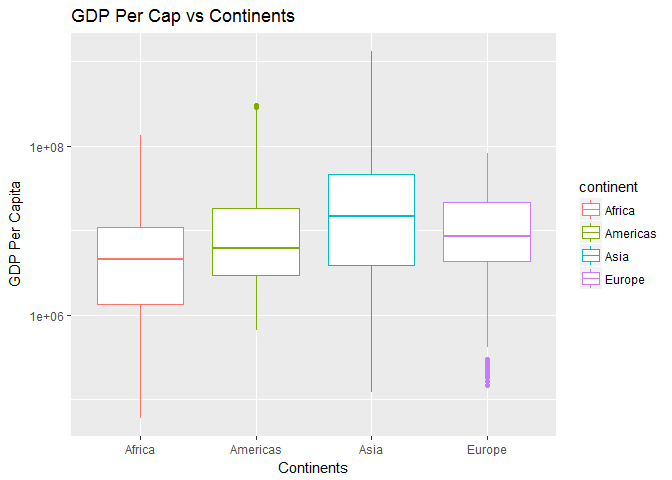
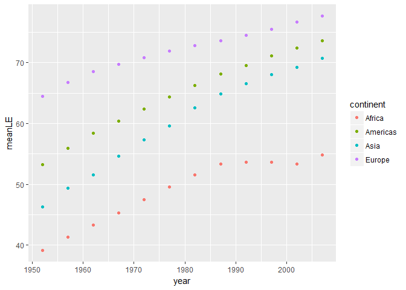
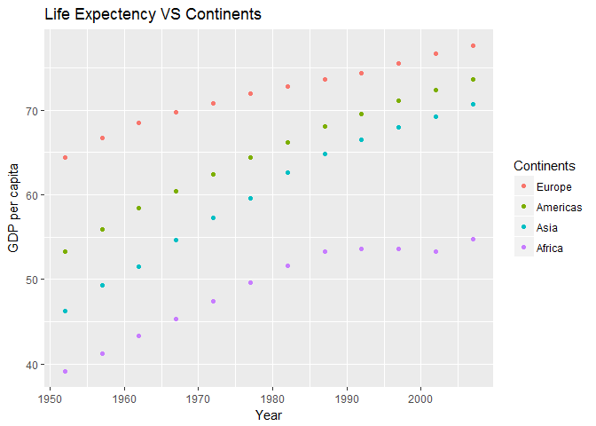
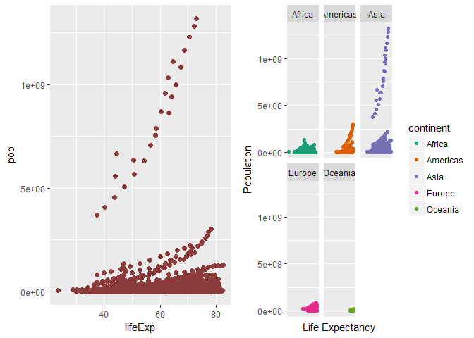
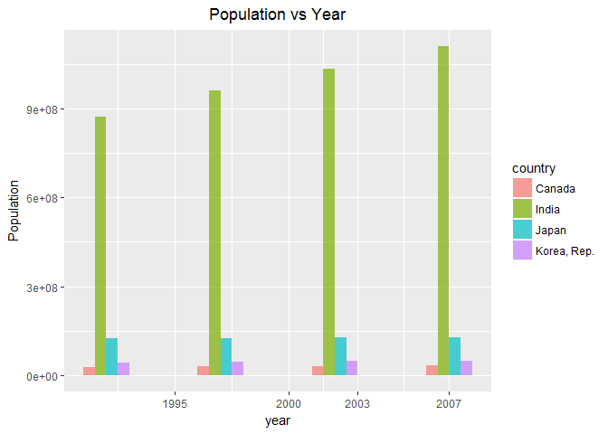
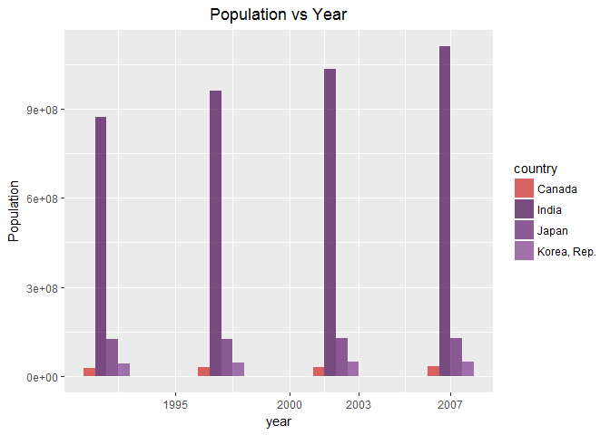

hw05
================

``` r
library(devtools)
install_github("JoeyBernhardt/singer")
```

    ## Skipping install of 'singer' from a github remote, the SHA1 (2b4fe9cb) has not changed since last install.
    ##   Use `force = TRUE` to force installation

``` r
suppressPackageStartupMessages(library(singer))
suppressPackageStartupMessages(library(gapminder))
suppressPackageStartupMessages(library(tidyverse))
suppressPackageStartupMessages(library(forcats))
suppressPackageStartupMessages(library(ggplot2))
```

Factor Management(Gapminder version)
------------------------------------

### 1. Drop Oceania

### Factorise. Filter the Gapminder data to remove observations associated with the continent of Oceania. Additionally, remove unused factor levels. Provide concrete information on the data before and after removing these rows and Oceania; address the number of rows and the levels of the affected factors.

Method 1 : Using drop\_levels()

#### Before dropping Oceania

``` r
nrow(gapminder)
```

    ## [1] 1704

``` r
length(levels(gapminder$continent))
```

    ## [1] 5

#### After dropping Oceania

``` r
gapminderWithoutOceaniaDropLevels <-gapminder %>% filter(continent != "Oceania") %>% droplevels()
gapminderWithoutOceania <- gapminder %>% filter(continent != "Oceania")
nrow(gapminderWithoutOceaniaDropLevels)
```

    ## [1] 1680

``` r
length(levels(gapminderWithoutOceaniaDropLevels$continent))
```

    ## [1] 4

``` r
levels(gapminderWithoutOceaniaDropLevels$continent)
```

    ## [1] "Africa"   "Americas" "Asia"     "Europe"

It is observed that 24 (i.e.., 1704-1680)entries were removed as a part of dropping the continent Oceania. It is observed that there are 4 continents and 1680 rows vs 5 continents versus 1704 rows in the original dataset. Thus we have verification of the removal of Oceania from our dataset.

OR

Method 2 : Drop Oceania Using fct\_drop()

``` r
gapminderWithoutOceania$continent %>%
  fct_drop() %>%
  levels()
```

    ## [1] "Africa"   "Americas" "Asia"     "Europe"

Hence the functions,droplevels, and fct\_drop(forcats) can be used to drop Oceania.

### Reorder the levels of country or continent. Use the forcats package to change the order of the factor levels, based on a principled summary of one of the quantitative variables. Consider experimenting with a summary statistic beyond the most basic choice of the median.

Solution :

Steps :

1)Continents with highest GDP Per Capita are arranged using arrange()

2)Created a knitr::kable for the max GDP Per Capita

3)Box plot ,using ggplot, of continent vs GDP Per Cap using log scale.

Quantitative variable used : GDP per cap.

``` r
maxgapPerCap <- gapminderWithoutOceaniaDropLevels %>%
  group_by(continent) %>%
  summarize(maxgdpPerCap=max(gdpPercap)) %>%
  arrange(desc(maxgdpPerCap))

ggplot(gapminderWithoutOceaniaDropLevels,aes(continent,pop)) + geom_boxplot(aes(color=continent)) + scale_y_log10("GDP Per Capita") + scale_x_discrete("Continents") + labs(title="GDP Per Cap vs Continents") + theme(plot.title = element_text()) 
```



``` r
knitr::kable(maxgapPerCap, format="markdown")
```

| continent |  maxgdpPerCap|
|:----------|-------------:|
| Asia      |     113523.13|
| Europe    |      49357.19|
| Americas  |      42951.65|
| Africa    |      21951.21|

Using fct\_reorder to list according to which continents have the highest GDP per capita

Here we observe that Europe has the highest GDP Per Capita while Africa has the lowest GDP per capita

``` r
gapminderWithoutOceaniaDropLevels$continent %>% 
  fct_reorder(gapminderWithoutOceaniaDropLevels$gdpPercap, .desc = TRUE) %>% 
  levels()
```

    ## [1] "Europe"   "Americas" "Asia"     "Africa"

Now reversing the above,that is, Using fct\_reorder to list according to which continents have the lowest GDP per capita

Here we observe that Africa has the lowest GDP Per Capita while Europe has the highest GDP per capita

``` r
gapminderWithoutOceaniaDropLevels$continent %>% 
  fct_reorder(gapminderWithoutOceaniaDropLevels$gdpPercap, .desc = FALSE) %>% 
  levels()
```

    ## [1] "Africa"   "Asia"     "Americas" "Europe"

### File I/O :Experiment with one or more of write\_csv()/read\_csv() (and/or TSV friends), saveRDS()/readRDS(), dput()/dget().

Solution :

1.  Read/Write Operations performed on CSV Files

``` r
write_csv(gapminderWithoutOceaniaDropLevels, "gapminderWithoutOceaniaDropLevels.csv")
gapminderWithoutOceaniaDropLevelsReadCSV <- read_csv("gapminderWithoutOceaniaDropLevels.csv")
```

    ## Parsed with column specification:
    ## cols(
    ##   country = col_character(),
    ##   continent = col_character(),
    ##   year = col_integer(),
    ##   lifeExp = col_double(),
    ##   pop = col_integer(),
    ##   gdpPercap = col_double()
    ## )

1.  Read/Write Operations performed on RDS Files

``` r
saveRDS(gapminderWithoutOceaniaDropLevels,"gapminderWithoutOceaniaDropLevels.rds")
gapminderWithoutOceaniaDropLevelsReadRDS <- readRDS("gapminderWithoutOceaniaDropLevels.rds")
```

1.  Read/Write Operations performed on Text Files

``` r
dput(gapminderWithoutOceaniaDropLevels,"gapminderWithoutOceaniaDropLevels.txt")
gapminderWithoutOceaniaDropLevelsReadTXT <- dget("gapminderWithoutOceaniaDropLevels.txt")
```

fct\_infreq() -&gt; Order by frequency

``` r
ContinentsFCTInFrequncy <- gapminderWithoutOceaniaDropLevels$continent %>% 
  fct_infreq() %>% 
  levels() %>% 
  head()
ContinentsFCTInFrequncy
```

    ## [1] "Africa"   "Asia"     "Europe"   "Americas"

fct\_count() -&gt; Provides the number of countries per continent

``` r
ContinentFCTCount <- gapminderWithoutOceaniaDropLevels$continent %>% 
  fct_count()    
ContinentFCTCount
```

    ## # A tibble: 4 x 2
    ##          f     n
    ##     <fctr> <int>
    ## 1   Africa   624
    ## 2 Americas   300
    ## 3     Asia   396
    ## 4   Europe   360

#### Common part:

While you’re here, practice writing to file and reading back in (see next section). Characterize the (derived) data before and after your factor re-leveling. Explore the effects of arrange(). Does merely arranging the data have any effect on, say, a figure? Explore the effects of reordering a factor and factor reordering coupled with arrange(). Especially, what effect does this have on a figure? These explorations should involve the data, the factor levels, and some figures.

### File I/O

Experiment with one or more of write\_csv()/read\_csv() (and/or TSV friends), saveRDS()/readRDS(), dput()/dget(). Create something new, probably by filtering or grouped-summarization of Singer or Gapminder. I highly recommend you fiddle with the factor levels, i.e. make them non-alphabetical (see previous section). Explore whether this survives the round trip of writing to file then reading back in.

Solution:

Both the queries above are answered below :

Answering the question:Explore the effects of arrange(). Does merely arranging the data have any effect on, say, a figure?

Plotting the lifeexpectency without using arrange()

Before Arrange() :

``` r
#Original plot without arrange
gapminderWithoutOceaniaDropLevels %>% 
  group_by(continent, year) %>% 
  summarize(meanLE = mean(lifeExp)) %>% 
  ggplot(aes(x = year, y = meanLE)) +
  geom_point(aes(colour = continent))
```



Now let's look at the plot after using arrange() Here we arrange the Lifeexpectancy in descending order using desc() within arrange().

After Arrange() : I'm using the variable "gapminderArrange" because I shall use the same in the next activity to compare arrange with the combination of arrange() and fct\_reorder()

``` r
gapminderArrange<-gapminderWithoutOceaniaDropLevels %>% 
  group_by(continent, year) %>% 
  summarize(meanLE = mean(lifeExp)) %>% 
  arrange(desc(meanLE))

  ggplot(gapminderArrange,aes(x = year, y = meanLE)) +
  geom_point(aes(colour = continent))
```


On comparing the above plots it is observed that the usage of arrange() has no impact on plots/figures.

Now let's try the same by incorporating the fct\_reorder() with arrange () and compare the figures/results.

Answering the question:Explore the effects of reordering a factor and factor reordering coupled with arrange(). Especially, what effect does this have on a figure?

Learning:

Inititally I executed the below code using fct\_reorder() and got an error. Spent sometime googling this error ,and learnt that fct\_reorder2() needs to be used instead of fct\_reoder here as I'm using year vs continent . Hence ,I've used fct\_reorder2() in the below example

``` r
  ggplot(gapminderArrange,aes(x = year, y = meanLE, colour = fct_reorder2(continent, year, meanLE))) +
  geom_point() +
  scale_colour_discrete(name = "Continents") +
  theme(plot.title = element_text()) +
  labs(title = "Life Expectency VS Continents", x = "Year", y = "GDP per capita")
```



On using the combination of arrange()+fct\_reorder2(),it is observed that the ggplot reflects the changes of re-ordering whereas arrange() function alone does not reflect the re-ordered changes on the plot/figures.

Answering the question : FIle I/O : Experiment with one or more of write\_csv()/read\_csv() (and/or TSV friends), saveRDS()/readRDS(), dput()/dget(). Create something new, probably by filtering or grouped-summarization of Singer or Gapminder. I highly recommend you fiddle with the factor levels, i.e. make them non-alphabetical (see previous section). Explore whether this survives the round trip of writing to file then reading back in.

Using the File I/O operations done as a part of Factorise,to show is re-ordering survives the writing to file and reading back in

Solution:

Reordering the gapminder(without Oceania) such that the continent with lowest Life Expectency appears first in the list.

``` r
gapminderWithoutOceaniaDropLevels$continent<-gapminderWithoutOceaniaDropLevels$continent %>% 
  fct_reorder(gapminderWithoutOceaniaDropLevels$lifeExp, .desc = FALSE)
levels(gapminderWithoutOceaniaDropLevels$continent)
```

    ## [1] "Africa"   "Asia"     "Americas" "Europe"

``` r
gapminderOrderLifeExpFactor <- factor(gapminderWithoutOceaniaDropLevels$continent)
class(gapminderOrderLifeExpFactor)
```

    ## [1] "factor"

``` r
is.factor(gapminderOrderLifeExpFactor)
```

    ## [1] TRUE

The above shows the original re-ordering(factor aswell),we shall compare this original re-ordered List with three different types of File Read/Write operations

Perform Read/Write operation on CSV files and compare the Order and factor

``` r
write_csv(gapminderWithoutOceaniaDropLevels, "gapminderOrderLifeExpFactor.csv")
gapminderOrderLifeExpFactorCSV<-read_csv("gapminderOrderLifeExpFactor.csv")
```

    ## Parsed with column specification:
    ## cols(
    ##   country = col_character(),
    ##   continent = col_character(),
    ##   year = col_integer(),
    ##   lifeExp = col_double(),
    ##   pop = col_integer(),
    ##   gdpPercap = col_double()
    ## )

``` r
str(gapminderOrderLifeExpFactorCSV$continent)
```

    ##  chr [1:1680] "Asia" "Asia" "Asia" "Asia" "Asia" "Asia" ...

``` r
is.factor(gapminderOrderLifeExpFactorCSV)
```

    ## [1] FALSE

``` r
#since "gapminderOrderLifeExpFactorCSV$continent" is saved a character use "as.factor" as shown below
gapminderOrderLifeExpFactorCSV$continent<-as.factor(gapminderOrderLifeExpFactorCSV$continent)
str(gapminderOrderLifeExpFactorCSV) # Now "gapminderOrderLifeExpFactorCSV$continent" is a factor
```

    ## Classes 'tbl_df', 'tbl' and 'data.frame':    1680 obs. of  6 variables:
    ##  $ country  : chr  "Afghanistan" "Afghanistan" "Afghanistan" "Afghanistan" ...
    ##  $ continent: Factor w/ 4 levels "Africa","Americas",..: 3 3 3 3 3 3 3 3 3 3 ...
    ##  $ year     : int  1952 1957 1962 1967 1972 1977 1982 1987 1992 1997 ...
    ##  $ lifeExp  : num  28.8 30.3 32 34 36.1 ...
    ##  $ pop      : int  8425333 9240934 10267083 11537966 13079460 14880372 12881816 13867957 16317921 22227415 ...
    ##  $ gdpPercap: num  779 821 853 836 740 ...
    ##  - attr(*, "spec")=List of 2
    ##   ..$ cols   :List of 6
    ##   .. ..$ country  : list()
    ##   .. .. ..- attr(*, "class")= chr  "collector_character" "collector"
    ##   .. ..$ continent: list()
    ##   .. .. ..- attr(*, "class")= chr  "collector_character" "collector"
    ##   .. ..$ year     : list()
    ##   .. .. ..- attr(*, "class")= chr  "collector_integer" "collector"
    ##   .. ..$ lifeExp  : list()
    ##   .. .. ..- attr(*, "class")= chr  "collector_double" "collector"
    ##   .. ..$ pop      : list()
    ##   .. .. ..- attr(*, "class")= chr  "collector_integer" "collector"
    ##   .. ..$ gdpPercap: list()
    ##   .. .. ..- attr(*, "class")= chr  "collector_double" "collector"
    ##   ..$ default: list()
    ##   .. ..- attr(*, "class")= chr  "collector_guess" "collector"
    ##   ..- attr(*, "class")= chr "col_spec"

``` r
levels(gapminderOrderLifeExpFactorCSV$continent)#Here check for Order
```

    ## [1] "Africa"   "Americas" "Asia"     "Europe"

``` r
is.factor(gapminderOrderLifeExpFactorCSV)
```

    ## [1] FALSE

On comparison the output CSV file seem to have lost the re-ordering and also "Continent"is not a "factor" anymore.

Perform Read /Write operation on RDS files and compare the Order and factor

``` r
saveRDS(gapminderWithoutOceaniaDropLevels,"gapminderOrderLifeExpFactor.rds")
gapminderOrderLifeExpFactorRDS<-readRDS("gapminderOrderLifeExpFactor.rds")
levels(gapminderOrderLifeExpFactorRDS$continent)
```

    ## [1] "Africa"   "Asia"     "Americas" "Europe"

``` r
class(gapminderOrderLifeExpFactorRDS$continent)
```

    ## [1] "factor"

``` r
is.factor(gapminderOrderLifeExpFactorRDS$continent)
```

    ## [1] TRUE

``` r
str(gapminderOrderLifeExpFactorRDS)
```

    ## Classes 'tbl_df', 'tbl' and 'data.frame':    1680 obs. of  6 variables:
    ##  $ country  : Factor w/ 140 levels "Afghanistan",..: 1 1 1 1 1 1 1 1 1 1 ...
    ##  $ continent: Factor w/ 4 levels "Africa","Asia",..: 2 2 2 2 2 2 2 2 2 2 ...
    ##  $ year     : int  1952 1957 1962 1967 1972 1977 1982 1987 1992 1997 ...
    ##  $ lifeExp  : num  28.8 30.3 32 34 36.1 ...
    ##  $ pop      : int  8425333 9240934 10267083 11537966 13079460 14880372 12881816 13867957 16317921 22227415 ...
    ##  $ gdpPercap: num  779 821 853 836 740 ...

On comparison the output RDS file preserves the re-ordering and also "Continent" remains a "factor" after write-read operation.

Perform Read /Write operation on Text files and compare the Order and factor

``` r
dput(gapminderWithoutOceaniaDropLevels,"gapminderOrderLifeExpFactor.txt")
gapminderOrderLifeExpFactorTXT<-dget("gapminderOrderLifeExpFactor.txt")
levels(gapminderOrderLifeExpFactorTXT$continent)
```

    ## [1] "Africa"   "Asia"     "Americas" "Europe"

``` r
class(gapminderOrderLifeExpFactorTXT$continent)
```

    ## [1] "factor"

``` r
is.factor(gapminderOrderLifeExpFactorTXT$continent)
```

    ## [1] TRUE

``` r
str(gapminderOrderLifeExpFactorTXT)
```

    ## Classes 'tbl_df', 'tbl' and 'data.frame':    1680 obs. of  6 variables:
    ##  $ country  : Factor w/ 140 levels "Afghanistan",..: 1 1 1 1 1 1 1 1 1 1 ...
    ##  $ continent: Factor w/ 4 levels "Africa","Asia",..: 2 2 2 2 2 2 2 2 2 2 ...
    ##  $ year     : int  1952 1957 1962 1967 1972 1977 1982 1987 1992 1997 ...
    ##  $ lifeExp  : num  28.8 30.3 32 34 36.1 ...
    ##  $ pop      : int  8425333 9240934 10267083 11537966 13079460 14880372 12881816 13867957 16317921 22227415 ...
    ##  $ gdpPercap: num  779 821 853 836 740 ...

On comparison the output text file preserves the re-ordering and also "Continent" remains a "factor" after write-read operation.

### Visualization design

Remake at least one figure or create a new one, in light of something you learned in the recent class meetings about visualization design and color. Maybe juxtapose your first attempt and what you obtained after some time spent working on it. Reflect on the differences. If using Gapminder, you can use the country or continent color scheme that ships with Gapminder. Consult the guest lecture from Tamara Munzner and everything here.

Solution :

As per my peer review comment in [homework3](https://github.com/jmurthy12/STAT545-hw-murthy-janani/issues/3),I was asked to add figures side-by-side.I shall incorporate these peer review comments in this homework using multiplot() taught in class [cm013](http://stat545.com/cm013_ggplot2-continued.html)

I would compare my first attempt using ggplot() to plot two quantitative varaiables [homework2](https://github.com/jmurthy12/STAT545-hw-murthy-janani/blob/master/hw02/hw02_gapminder.md) with my recent learnings on plots.

From my [homework2](https://github.com/jmurthy12/STAT545-hw-murthy-janani/blob/master/hw02/hw02_gapminder.md)

Scatter plot between : Quantitative variable 1 : Life Expectancy Quantitative variable 2 : Population

``` r
IntialLearning<-ggplot(gapminder, 
      aes(x=lifeExp, y=pop)) +
      geom_point(size = 2, color = "indianred4")
```

Plots based on my recent Learnings

``` r
FromRecentLearings <- ggplot(gapminder, aes(x=lifeExp, y=pop)) + 
  geom_point(aes(color=continent)) + 
  scale_x_log10() +
  labs("Life Expectancy vs. Population") +
  labs(x="Life Expectancy", y="Population") +
  theme(plot.title = element_text(hjust=0.5)) +
  facet_wrap(~ continent) + 
  scale_colour_brewer(palette="Dark2") 
```

``` r
source("http://peterhaschke.com/Code/multiplot.R")
```

``` r
multiplot(IntialLearning,FromRecentLearings,cols = 2)
```

    ## Loading required package: grid



Another try on plots using library(RColorBrewer):

Plotted population vs year for 4 countries using the techniques taught in class.

``` r
library(RColorBrewer)

gapminderRcolorBrewer <- gapminder %>% 
  filter((country%in%c("Canada","India","Korea, Rep.","Japan") & (year>1990))) %>%
  ggplot(aes(year)) + geom_bar(aes(weight=pop,fill=country),position = "dodge",width=2,alpha=0.7) + scale_y_continuous("Population") + labs(title="Population vs Year") + theme(plot.title=element_text(hjust=0.5)) + scale_x_continuous(breaks = c(1995,2000,2003,2007))
gapminderRcolorBrewer
```



``` r
gapminderRcolorBrewer<-gapminderRcolorBrewer+scale_fill_manual(values=country_colors)+scale_colour_gradient(low="yellow",high="blue")
gapminderRcolorBrewer
```



### Writing figures to file

Use ggsave() to explicitly save a plot to file. Then use  to load and embed it in your report. You can play around with various options, such as:

Arguments of ggsave(), such as width, height, resolution or text scaling. Various graphics devices, e.g. a vector vs. raster format. Explicit provision of the plot object p via ggsave(..., plot = p). Show a situation in which this actually matters.

``` r
ggsave("lifeExpectancyvsPopulation.png")
```

    ## Saving 7 x 5 in image

``` r
ggsave("lifeExpectancyvsPopulation.pdf")
```

    ## Saving 7 x 5 in image

Arguments of ggsave(), such as width, height.

Vector Format

``` r
ggsave("lifeExpectancyvsPopulationVector.png",device = "png", plot = FromRecentLearings, width = 9, height = 9) 
```

Arguments of gsgsave() - resolution.

``` r
ggsave("lifeExpectancyvsPopulationResolution.png",device = "png",FromRecentLearings,width = 8,height = 8, dpi=300)
```

Raster Format

``` r
ggsave("lifeExpectancyvsPopulationRaster.png", device = "png",plot = FromRecentLearings, width = 8, height = 8, dpi = 300)
```


Plotting Vector Format VS Raster Format

 

Explicit provision of the plot object p via ggsave(..., plot = p). Show a situation in which this actually matters.

Solution : Incase we do not specify "plot=p", then then previous plot is saved automatically. Example :In the below example Raterm Form.png is saved with the new arguments specified.

``` r
ggsave("lifeExpectancyvsPopulationRaster.png", device = "png",width = 4, height = 4, dpi = 600)
```


### Organise your github

-   My first [README.md](https://github.com/jmurthy12/STAT545-hw-murthy-janani/blob/master/README.md)is updated with links to the remaining homework folders and .md files.

-   In each of my homework folder ,I made sure that there no weird, vestigial files lying around to puzzle me in future.

### But I want to do more!

Make a deeper exploration of the forcats packages, i.e. try more of the factor level reordering functions. Gapminder version: Pick a handful of countries, each of which you can associate with a stereotypical food (or any other non-controversial thing … sport? hobby? type of music, art or dance? animal? landscape feature?). Create an excerpt of the Gapminder data, filtered to just these countries. Create a new factor – you pick the name! – by mapping the existing country factor levels to the new levels. Examples: Italy –&gt; wine, Germany –&gt; beer, Japan –&gt; sake. (Austria, Germany) –&gt; German, (Mexico, Spain) –&gt; Spanish, (Portugal, Brazil) –&gt; Portuguese. Let your creativity flourish.

Solution :

Creating a new data frame consisting of Countries and it's presidents for year 2005

``` r
country <- c('Italy', 'Germany', 'Japan', 'Austria', 
             'Spain', 'Brazil')
presidents <- c('Carlo Azeglio Ciampi', 'Horst Köhler', 'Akihito', "Heinz Fischer", 
                  'Juan Carlos I', 'Luiz Inácio Lula da Silva')

country_presidents <- data.frame(country, presidents)

knitr::kable(country_presidents,format="markdown")
```

| country | presidents                |
|:--------|:--------------------------|
| Italy   | Carlo Azeglio Ciampi      |
| Germany | Horst Köhler              |
| Japan   | Akihito                   |
| Austria | Heinz Fischer             |
| Spain   | Juan Carlos I             |
| Brazil  | Luiz Inácio Lula da Silva |

-   Mutating gapminder dataset to add a new column containing presidents
-   fct\_recode() is used here to revalue the levels
-   droplevels() that do not contain an entry for president
-   Use knitr::kable to display the addition of new column - Presidents

``` r
gapminderCountryPresidents <- gapminder %>% 
  filter(country %in% c("Italy","Germany","Japan","Austria","Spain","Brazil")) %>% 
  mutate(presidents = fct_recode(country, "Carlo Azeglio Ciampi" = "Italy","Horst Köhler" = "Germany","Akihito" = "Japan","Heinz Fischer" = "Austria","Juan Carlos I" = "Spain","Luiz Inácio Lula da Silva" = "Brazil")) %>% 
  droplevels()

#Change countr from character to factor
gapminderCountryPresidents$country <- as.factor(gapminderCountryPresidents$country)
knitr::kable(head(gapminderCountryPresidents))
```

| country | continent |  year|  lifeExp|      pop|  gdpPercap| presidents    |
|:--------|:----------|-----:|--------:|--------:|----------:|:--------------|
| Austria | Europe    |  1952|    66.80|  6927772|   6137.076| Heinz Fischer |
| Austria | Europe    |  1957|    67.48|  6965860|   8842.598| Heinz Fischer |
| Austria | Europe    |  1962|    69.54|  7129864|  10750.721| Heinz Fischer |
| Austria | Europe    |  1967|    70.14|  7376998|  12834.602| Heinz Fischer |
| Austria | Europe    |  1972|    70.63|  7544201|  16661.626| Heinz Fischer |
| Austria | Europe    |  1977|    72.17|  7568430|  19749.422| Heinz Fischer |

``` r
knitr::kable(tail(gapminderCountryPresidents))
```

| country    | continent    |     year|     lifeExp|          pop|    gdpPercap| presidents     |
|:-----------|:-------------|--------:|-----------:|------------:|------------:|:---------------|
| Spain      | Europe       |     1982|      76.300|     37983310|     13926.17| Juan Carlos I  |
| Spain      | Europe       |     1987|      76.900|     38880702|     15764.98| Juan Carlos I  |
| Spain      | Europe       |     1992|      77.570|     39549438|     18603.06| Juan Carlos I  |
| Spain      | Europe       |     1997|      78.770|     39855442|     20445.30| Juan Carlos I  |
| Spain      | Europe       |     2002|      79.780|     40152517|     24835.47| Juan Carlos I  |
| Spain      | Europe       |     2007|      80.941|     40448191|     28821.06| Juan Carlos I  |
| Display th | e new set wi |  th appe|  nded colum|  n for presi|  dents using| knitr::kable() |

``` r
levels(gapminderCountryPresidents$presidents)
```

    ## [1] "Heinz Fischer"             "Luiz Inácio Lula da Silva"
    ## [3] "Horst Köhler"              "Carlo Azeglio Ciampi"     
    ## [5] "Akihito"                   "Juan Carlos I"

``` r
levels(gapminderCountryPresidents$country) 
```

    ## [1] "Austria" "Brazil"  "Germany" "Italy"   "Japan"   "Spain"

``` r
filter<-gapminderCountryPresidents %>% 
  group_by(continent,year,presidents) %>% 
  select (country,presidents)
```

    ## Adding missing grouping variables: `continent`, `year`

``` r
knitr::kable(filter)
```

| continent |  year| country | presidents                |
|:----------|-----:|:--------|:--------------------------|
| Europe    |  1952| Austria | Heinz Fischer             |
| Europe    |  1957| Austria | Heinz Fischer             |
| Europe    |  1962| Austria | Heinz Fischer             |
| Europe    |  1967| Austria | Heinz Fischer             |
| Europe    |  1972| Austria | Heinz Fischer             |
| Europe    |  1977| Austria | Heinz Fischer             |
| Europe    |  1982| Austria | Heinz Fischer             |
| Europe    |  1987| Austria | Heinz Fischer             |
| Europe    |  1992| Austria | Heinz Fischer             |
| Europe    |  1997| Austria | Heinz Fischer             |
| Europe    |  2002| Austria | Heinz Fischer             |
| Europe    |  2007| Austria | Heinz Fischer             |
| Americas  |  1952| Brazil  | Luiz Inácio Lula da Silva |
| Americas  |  1957| Brazil  | Luiz Inácio Lula da Silva |
| Americas  |  1962| Brazil  | Luiz Inácio Lula da Silva |
| Americas  |  1967| Brazil  | Luiz Inácio Lula da Silva |
| Americas  |  1972| Brazil  | Luiz Inácio Lula da Silva |
| Americas  |  1977| Brazil  | Luiz Inácio Lula da Silva |
| Americas  |  1982| Brazil  | Luiz Inácio Lula da Silva |
| Americas  |  1987| Brazil  | Luiz Inácio Lula da Silva |
| Americas  |  1992| Brazil  | Luiz Inácio Lula da Silva |
| Americas  |  1997| Brazil  | Luiz Inácio Lula da Silva |
| Americas  |  2002| Brazil  | Luiz Inácio Lula da Silva |
| Americas  |  2007| Brazil  | Luiz Inácio Lula da Silva |
| Europe    |  1952| Germany | Horst Köhler              |
| Europe    |  1957| Germany | Horst Köhler              |
| Europe    |  1962| Germany | Horst Köhler              |
| Europe    |  1967| Germany | Horst Köhler              |
| Europe    |  1972| Germany | Horst Köhler              |
| Europe    |  1977| Germany | Horst Köhler              |
| Europe    |  1982| Germany | Horst Köhler              |
| Europe    |  1987| Germany | Horst Köhler              |
| Europe    |  1992| Germany | Horst Köhler              |
| Europe    |  1997| Germany | Horst Köhler              |
| Europe    |  2002| Germany | Horst Köhler              |
| Europe    |  2007| Germany | Horst Köhler              |
| Europe    |  1952| Italy   | Carlo Azeglio Ciampi      |
| Europe    |  1957| Italy   | Carlo Azeglio Ciampi      |
| Europe    |  1962| Italy   | Carlo Azeglio Ciampi      |
| Europe    |  1967| Italy   | Carlo Azeglio Ciampi      |
| Europe    |  1972| Italy   | Carlo Azeglio Ciampi      |
| Europe    |  1977| Italy   | Carlo Azeglio Ciampi      |
| Europe    |  1982| Italy   | Carlo Azeglio Ciampi      |
| Europe    |  1987| Italy   | Carlo Azeglio Ciampi      |
| Europe    |  1992| Italy   | Carlo Azeglio Ciampi      |
| Europe    |  1997| Italy   | Carlo Azeglio Ciampi      |
| Europe    |  2002| Italy   | Carlo Azeglio Ciampi      |
| Europe    |  2007| Italy   | Carlo Azeglio Ciampi      |
| Asia      |  1952| Japan   | Akihito                   |
| Asia      |  1957| Japan   | Akihito                   |
| Asia      |  1962| Japan   | Akihito                   |
| Asia      |  1967| Japan   | Akihito                   |
| Asia      |  1972| Japan   | Akihito                   |
| Asia      |  1977| Japan   | Akihito                   |
| Asia      |  1982| Japan   | Akihito                   |
| Asia      |  1987| Japan   | Akihito                   |
| Asia      |  1992| Japan   | Akihito                   |
| Asia      |  1997| Japan   | Akihito                   |
| Asia      |  2002| Japan   | Akihito                   |
| Asia      |  2007| Japan   | Akihito                   |
| Europe    |  1952| Spain   | Juan Carlos I             |
| Europe    |  1957| Spain   | Juan Carlos I             |
| Europe    |  1962| Spain   | Juan Carlos I             |
| Europe    |  1967| Spain   | Juan Carlos I             |
| Europe    |  1972| Spain   | Juan Carlos I             |
| Europe    |  1977| Spain   | Juan Carlos I             |
| Europe    |  1982| Spain   | Juan Carlos I             |
| Europe    |  1987| Spain   | Juan Carlos I             |
| Europe    |  1992| Spain   | Juan Carlos I             |
| Europe    |  1997| Spain   | Juan Carlos I             |
| Europe    |  2002| Spain   | Juan Carlos I             |
| Europe    |  2007| Spain   | Juan Carlos I             |
