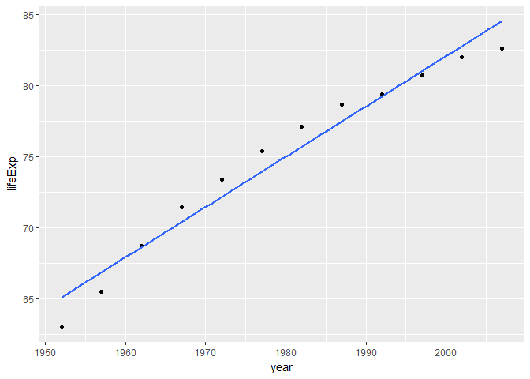
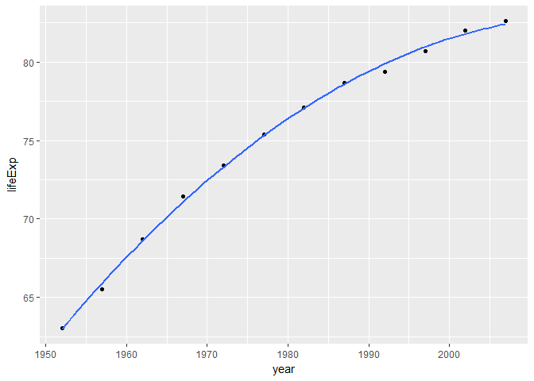
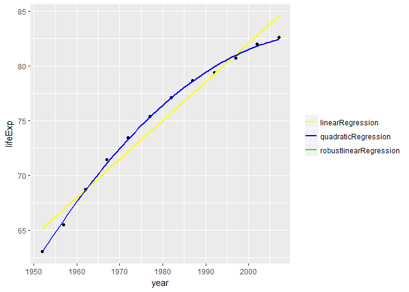
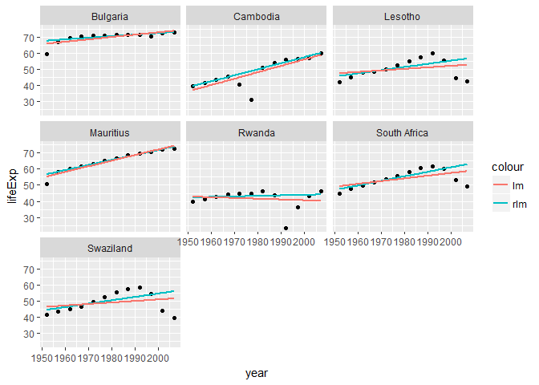

hw06\_DataWrangling\_WrapUp
================

Table of Contents
=================

-   1.Writing functions :
    -   Write one (or more) functions that do something useful to pieces of the Gapminder or Singer data. It is logical to think about computing on the mini-data frames corresponding to the data for each specific country, location, year, band, album, … This would pair well with the prompt below about working with a nested data frame, as you could apply your function there.
    -   Make it something you can’t easily do with built-in functions. Make it something that’s not trivial to do with the simple dplyr verbs. The linear regression function presented here is a good starting point. You could generalize that to do quadratic regression (include a squared term) or use robust regression, using MASS::rlm() or robustbase::lmrob().
-   2.Work with a nested data frame

    -   See the split-apply-combine lesson from class.Nest the data by country (and continent). Fit a model of life expectancy against year. Possibly quadratic, possibly robust (see above prompt re: function writing).
    -   Use functions for working with fitted models or the broom package to get information out of your linear models.
    -   Use the usual dplyr, tidyr, and ggplot2 workflows to explore, e.g., the estimated cofficients. Inspiration for the modelling and downstream inspiration
    -   Find countries with interesting stories. - Sudden, substantial departures from the temporal trend is interesting. How could you operationalize this notion of “interesting”?
    -   Use the residuals to detect countries where your model is a terrible fit. Examples: Are there are 1 or more freakishly large residuals, in an absolute sense or relative to some estimate of background variability? Are there strong patterns in the sign of the residuals? E.g., all pos, then all neg, then pos again.
    -   Fit a regression using ordinary least squares and a robust technique. Determine the difference in estimated parameters under the two approaches. If it is large, consider that country “interesting”. Compare a linear and quadratic fit

``` r
suppressPackageStartupMessages(library(gapminder))
suppressPackageStartupMessages(library(ggplot2))
suppressPackageStartupMessages(library(broom))
suppressPackageStartupMessages(library(tidyverse))
suppressPackageStartupMessages(library(MASS))
```

Writing functions
=================

Let's choose to work on a mini-data frame of specific country

``` r
select_country <-"Japan"
countrySelected <- gapminder %>% 
                  filter( country == select_country) 
knitr::kable( countrySelected )
```

| country | continent |  year|  lifeExp|        pop|  gdpPercap|
|:--------|:----------|-----:|--------:|----------:|----------:|
| Japan   | Asia      |  1952|   63.030|   86459025|   3216.956|
| Japan   | Asia      |  1957|   65.500|   91563009|   4317.694|
| Japan   | Asia      |  1962|   68.730|   95831757|   6576.649|
| Japan   | Asia      |  1967|   71.430|  100825279|   9847.789|
| Japan   | Asia      |  1972|   73.420|  107188273|  14778.786|
| Japan   | Asia      |  1977|   75.380|  113872473|  16610.377|
| Japan   | Asia      |  1982|   77.110|  118454974|  19384.106|
| Japan   | Asia      |  1987|   78.670|  122091325|  22375.942|
| Japan   | Asia      |  1992|   79.360|  124329269|  26824.895|
| Japan   | Asia      |  1997|   80.690|  125956499|  28816.585|
| Japan   | Asia      |  2002|   82.000|  127065841|  28604.592|
| Japan   | Asia      |  2007|   82.603|  127467972|  31656.068|

Reference for "lm" is avaiable [here](http://stat545.com/block012_function-regress-lifeexp-on-year.html)

#### Let's apply linear regression,quadractic regression and robust regression on "countrySelected" and plot them

``` r
#Linear Regression
countrySelectedYearVsLifeExp <- countrySelected %>% 
  ggplot( aes( x = year , y = lifeExp ) )

countrySelectedYearVsLifeExp + geom_point() + geom_smooth(method = "lm", se = FALSE)
```



-   [This](http://www.theanalysisfactor.com/r-tutorial-4/) is my reference for Quadractic Model.

-   This [link](https://www.r-bloggers.com/fitting-polynomial-regression-in-r/) on "how to fit a polynomial regression" was useful.

``` r
#Quadratic Regression
countrySelectedYearVsLifeExp <- countrySelected %>% 
  ggplot( aes( x = year , y = lifeExp ) )

countrySelectedYearVsLifeExp + geom_point() + geom_smooth(method = "lm",formula = y ~ x + I( x^2 ) , se = FALSE)
```



``` r
#Robust Linear Regression
countrySelectedYearVsLifeExp <- countrySelected %>% 
  ggplot( aes( x = year , y = lifeExp ) )

countrySelectedYearVsLifeExp + geom_point() + geom_smooth(method = "rlm", se = FALSE)
```


Plotting all 3 regressions results on a single graph.

``` r
countrySelectedYearVsLifeExp + geom_point( ) + 
  geom_smooth( method = "rlm" , aes( colour = "robustlinearRegression" ) , se = FALSE ) +
  geom_smooth( method = "lm" , aes( colour = "linearRegression" ) ,se = FALSE ) + 
  geom_smooth( method = "lm" , formula = y ~ x + I( x^2 ) , aes( colour = "quadraticRegression" ), se = FALSE ) +
  scale_color_manual( NULL, values = c(  "robustlinearRegression" = "green" ,"linearRegression" = "yellow" , "quadraticRegression" = "blue" ) )
```



From the above plot,it is understood that Linear regression results(Yellow) coincide with the results for Robust Linear Regression(Green).

Let's try to fit the regression on our data similar to this [link](http://stat545.com/block012_function-regress-lifeexp-on-year.html#get-some-code-that-works)

``` r
#Fit the Quadratic Regression and find the coefficients

quadraticFitOnCountrySelected <- lm( lifeExp ~ I( year - 1952 ) + I( ( year - 1952 )^2 ) , data = countrySelected )
coef( quadraticFitOnCountrySelected )
```

    ##        (Intercept)     I(year - 1952) I((year - 1952)^2) 
    ##        62.99542582         0.60809925        -0.00463991

Let's write a function for the Quadratic Regression

``` r
quadraticFitFunctionOnCountrySelected <- function( data , offset = 1952 ){
  quadraticFit <- lm( lifeExp ~ I( year - offset ) + I( ( year - offset )^2 ) , data = data )
  setNames( coef( quadraticFit ) , c( "intercept" , "slope 1" , "slope 2" ) )
}

## Let's Test the Function for Robust Linear Regression and Compare the results
quadraticFitFunctionOnCountrySelected( countrySelected )
```

    ##   intercept     slope 1     slope 2 
    ## 62.99542582  0.60809925 -0.00463991

Same Results for Quadratic regression are obtained for Intercept and Slope values .

``` r
#Fit the Robust Linear Regression and find the coefficients

robustFitOnCountrySelected <- rlm( lifeExp ~ I( year - 1952 ) , data = countrySelected )
coef( robustFitOnCountrySelected )
```

    ##    (Intercept) I(year - 1952) 
    ##     65.1220513      0.3529042

Let's write a function for the Robust Linear Regression

``` r
robustFitFunctionOnCountrySelected <- function( data , offset = 1952 ) {
  robustFit <- rlm( lifeExp ~ I( year - offset ) , data = data )
  setNames( coef( robustFit ) , c( "intercept" , "slope" ) )
}

## Let's Test the Function for Robust Linear Regression and Compare the results
robustFitFunctionOnCountrySelected( countrySelected )
```

    ##  intercept      slope 
    ## 65.1220513  0.3529042

Same Results for Robust linear regression are obtained for Intercept and Slope values .

``` r
#Fit the Linear Regression
linearFitOncountrySelected <- lm( lifeExp ~ I( year - 1952 ) , data = countrySelected )
coef( linearFitOncountrySelected )
```

    ##    (Intercept) I(year - 1952) 
    ##     65.1220513      0.3529042

``` r
#Let's write a function for Linear Fit
select_country <-"Japan"
countrySelected <- gapminder %>% 
                  filter( country == select_country) 

linearFitFunctionOncountrySelected <- function( data , offset = 1952 ){
  linearFit <- lm( lifeExp ~ I( year - offset ) , data = data )
  setNames( coef( linearFit ) , c( "intercept" , "slope" ) )
}

## Let's Test the Function for Linear Regression and Compare the results

linearFitFunctionOncountrySelected(countrySelected)
```

    ##  intercept      slope 
    ## 65.1220513  0.3529042

Same Results for linear regression are obtained for Intercept and Slope values.

Work with a nested data frame
=============================

-   Reference for Nested Data frame,broom-&gt;Tidy(),map(), and mutate() is available [here](http://stat545.com/block024_group-nest-split-map.html)

-   Reference for Broom is available [here](https://github.com/tidyverse/broom)

-   Reference for dplyr::do() is available [here](http://stat545.com/block023_dplyr-do.html)

Question :Nest the data by country (and continent).

Let's create a Nested Dataframe

-   Reference for Nested dataframe is from[class notes](http://stat545.com/block024_group-nest-split-map.html#general-approach-nesting)

``` r
nestedGapminder <- gapminder %>% 
  group_by( continent , country ) %>% 
  nest( )
nestedGapminder
```

    ## # A tibble: 142 x 3
    ##    continent     country              data
    ##       <fctr>      <fctr>            <list>
    ##  1      Asia Afghanistan <tibble [12 x 4]>
    ##  2    Europe     Albania <tibble [12 x 4]>
    ##  3    Africa     Algeria <tibble [12 x 4]>
    ##  4    Africa      Angola <tibble [12 x 4]>
    ##  5  Americas   Argentina <tibble [12 x 4]>
    ##  6   Oceania   Australia <tibble [12 x 4]>
    ##  7    Europe     Austria <tibble [12 x 4]>
    ##  8      Asia     Bahrain <tibble [12 x 4]>
    ##  9      Asia  Bangladesh <tibble [12 x 4]>
    ## 10    Europe     Belgium <tibble [12 x 4]>
    ## # ... with 132 more rows

The Nested Gapminder Data frame collapses to 142 rows, one per country.

Let's expand the nested dataframe "data"

``` r
nestedGapminder[[1, "data"]]
```

    ## # A tibble: 12 x 4
    ##     year lifeExp      pop gdpPercap
    ##    <int>   <dbl>    <int>     <dbl>
    ##  1  1952  28.801  8425333  779.4453
    ##  2  1957  30.332  9240934  820.8530
    ##  3  1962  31.997 10267083  853.1007
    ##  4  1967  34.020 11537966  836.1971
    ##  5  1972  36.088 13079460  739.9811
    ##  6  1977  38.438 14880372  786.1134
    ##  7  1982  39.854 12881816  978.0114
    ##  8  1987  40.822 13867957  852.3959
    ##  9  1992  41.674 16317921  649.3414
    ## 10  1997  41.763 22227415  635.3414
    ## 11  2002  42.129 25268405  726.7341
    ## 12  2007  43.828 31889923  974.5803

Question:Fit a model of life expectancy against year. Possibly quadratic, possibly robust (see above prompt re: function writing).

Solution:

Choose Japan,which is the 67th country in the nested Dataframe and apply Linear Fit

Compare the results to verify the intercept and Slope values.

``` r
linearFitFunctionOncountrySelected( nestedGapminder$data[[67]] )
```

    ##  intercept      slope 
    ## 65.1220513  0.3529042

The intercept and slope values match the previous results of Linear Regression.

Let's map Linear Fit Function over the nestedGapminder Reference for the below sections is from [split-apply-combine lesson from class](http://stat545.com/block024_group-nest-split-map.html#apply-a-function-map-and-mutate)

``` r
#Use purrr::map() to apply the fitting function linearFitFunctionOncountrySelected()
#to the first two elements of nestedGapminder$data.
map( nestedGapminder$data[1:2] , linearFitFunctionOncountrySelected )
```

    ## [[1]]
    ##  intercept      slope 
    ## 29.9072949  0.2753287 
    ## 
    ## [[2]]
    ##  intercept      slope 
    ## 59.2291282  0.3346832

Scale this up to all countries by using map() and mutate () to the entire nested dataframe

``` r
(nestedGapminderLinearFit <- nestedGapminder %>% 
  mutate( linearFit = map( data , linearFitFunctionOncountrySelected ) ))
```

    ## # A tibble: 142 x 4
    ##    continent     country              data linearFit
    ##       <fctr>      <fctr>            <list>    <list>
    ##  1      Asia Afghanistan <tibble [12 x 4]> <dbl [2]>
    ##  2    Europe     Albania <tibble [12 x 4]> <dbl [2]>
    ##  3    Africa     Algeria <tibble [12 x 4]> <dbl [2]>
    ##  4    Africa      Angola <tibble [12 x 4]> <dbl [2]>
    ##  5  Americas   Argentina <tibble [12 x 4]> <dbl [2]>
    ##  6   Oceania   Australia <tibble [12 x 4]> <dbl [2]>
    ##  7    Europe     Austria <tibble [12 x 4]> <dbl [2]>
    ##  8      Asia     Bahrain <tibble [12 x 4]> <dbl [2]>
    ##  9      Asia  Bangladesh <tibble [12 x 4]> <dbl [2]>
    ## 10    Europe     Belgium <tibble [12 x 4]> <dbl [2]>
    ## # ... with 132 more rows

Let's test the above result : Cross Check the regression results for "Japan"

``` r
nestedGapminderLinearFit$linearFit[[67]]
```

    ##  intercept      slope 
    ## 65.1220513  0.3529042

Question : Use functions for working with fitted models or the broom package to get information out of your linear models

Solution:

Let's use functions from broom package to get information out of your linear models.

``` r
## Let's map the tidy function to the entire nested dataframe

(nestedGapminderLinearFit <- nestedGapminderLinearFit %>% 
  mutate( tidy = map( linearFit , tidy ) ))
```

    ## # A tibble: 142 x 5
    ##    continent     country              data linearFit             tidy
    ##       <fctr>      <fctr>            <list>    <list>           <list>
    ##  1      Asia Afghanistan <tibble [12 x 4]> <dbl [2]> <tibble [2 x 2]>
    ##  2    Europe     Albania <tibble [12 x 4]> <dbl [2]> <tibble [2 x 2]>
    ##  3    Africa     Algeria <tibble [12 x 4]> <dbl [2]> <tibble [2 x 2]>
    ##  4    Africa      Angola <tibble [12 x 4]> <dbl [2]> <tibble [2 x 2]>
    ##  5  Americas   Argentina <tibble [12 x 4]> <dbl [2]> <tibble [2 x 2]>
    ##  6   Oceania   Australia <tibble [12 x 4]> <dbl [2]> <tibble [2 x 2]>
    ##  7    Europe     Austria <tibble [12 x 4]> <dbl [2]> <tibble [2 x 2]>
    ##  8      Asia     Bahrain <tibble [12 x 4]> <dbl [2]> <tibble [2 x 2]>
    ##  9      Asia  Bangladesh <tibble [12 x 4]> <dbl [2]> <tibble [2 x 2]>
    ## 10    Europe     Belgium <tibble [12 x 4]> <dbl [2]> <tibble [2 x 2]>
    ## # ... with 132 more rows

I faced an error on running (only)the above block of code : Error : "Error in mutate\_impl(.data, dots) : Evaluation error: Index 1 must have length 1." However,I don't get the same error on knitting the code .I did try stack overflow to get an idea of this error , but I'm still not able to figure out the rootcause.If someone could help me out ,it would be great!

Let's test the above Mapped function for Japan and compare with our earlier results for Japan

``` r
nestedGapminderLinearFit$tidy[[67]]
```

    ## # A tibble: 2 x 2
    ##       names          x
    ##       <chr>      <dbl>
    ## 1 intercept 65.1220513
    ## 2     slope  0.3529042

Same intercept and slope values are returned .

Let's extract some more information of Linear models using broom package's do() function

``` r
(leVsYear_LinearFit_Broom <- gapminder %>% 
  group_by( continent , country ) %>% 
  do( linearFit = lm( lifeExp ~ I( year - 1952 ) , . ) ))
```

    ## Source: local data frame [142 x 3]
    ## Groups: <by row>
    ## 
    ## # A tibble: 142 x 3
    ##    continent                  country linearFit
    ##  *    <fctr>                   <fctr>    <list>
    ##  1    Africa                  Algeria  <S3: lm>
    ##  2    Africa                   Angola  <S3: lm>
    ##  3    Africa                    Benin  <S3: lm>
    ##  4    Africa                 Botswana  <S3: lm>
    ##  5    Africa             Burkina Faso  <S3: lm>
    ##  6    Africa                  Burundi  <S3: lm>
    ##  7    Africa                 Cameroon  <S3: lm>
    ##  8    Africa Central African Republic  <S3: lm>
    ##  9    Africa                     Chad  <S3: lm>
    ## 10    Africa                  Comoros  <S3: lm>
    ## # ... with 132 more rows

``` r
## Let's use tidy() on the above block of code

knitr::kable( ( leVsYear_LinearFit_Broom %>% 
                  tidy( linearFit ) ) %>% 
                tail( ) )
```

| continent | country        | term           |    estimate|  std.error|  statistic|  p.value|
|:----------|:---------------|:---------------|-----------:|----------:|----------:|--------:|
| Europe    | United Kingdom | (Intercept)    |  68.8085256|  0.2400794|  286.60732|    0e+00|
| Europe    | United Kingdom | I(year - 1952) |   0.1859657|  0.0073944|   25.14969|    0e+00|
| Oceania   | Australia      | (Intercept)    |  68.4005128|  0.3370035|  202.96678|    0e+00|
| Oceania   | Australia      | I(year - 1952) |   0.2277238|  0.0103796|   21.93960|    0e+00|
| Oceania   | New Zealand    | (Intercept)    |  68.6869231|  0.4367774|  157.25842|    0e+00|
| Oceania   | New Zealand    | I(year - 1952) |   0.1928210|  0.0134526|   14.33339|    1e-07|

Let's use unnest() function to display the tidy information corresponding to it's country

``` r
#glue the results back together
knitr::kable( ( nestedGapminderLinearFitUnnest <- nestedGapminderLinearFit %>% 
                  dplyr::select(  country , tidy ) %>% 
                  unnest( tidy ) )%>% 
                tail( ) )
```

| country     | names     |           x|
|:------------|:----------|-----------:|
| Yemen, Rep. | intercept |  30.1302821|
| Yemen, Rep. | slope     |   0.6054594|
| Zambia      | intercept |  47.6580256|
| Zambia      | slope     |  -0.0604252|
| Zimbabwe    | intercept |  55.2212436|
| Zimbabwe    | slope     |  -0.0930210|

-   Question : Use the usual dplyr, tidyr, and ggplot2 workflows to explore, e.g., the estimated cofficients.

Solution :

``` r
knitr::kable( ( nestedGapminderLinearFitUnnestExplore <- nestedGapminderLinearFitUnnest %>% 
                  dplyr::select( country:x ) %>% 
                  spread( key = "names" , value = "x" ) ) %>% 
                tail( ) )
```

| country            |  intercept|       slope|
|:-------------------|----------:|-----------:|
| Venezuela          |   57.51332|   0.3297217|
| Vietnam            |   39.01008|   0.6716154|
| West Bank and Gaza |   43.79840|   0.6011007|
| Yemen, Rep.        |   30.13028|   0.6054594|
| Zambia             |   47.65803|  -0.0604252|
| Zimbabwe           |   55.22124|  -0.0930210|

Let's fit a model of life expectancy against year(Function) on the Nested dataframe using Robust Regression

``` r
select_country <-"Japan"
countrySelected <- gapminder %>% 
                  filter( country == select_country) 

# Let's write a function for the Robust Linear Regression
robustFitFunctionOnCountrySelected <- function( data , offset = 1952 ) {
  robustFit <- rlm( lifeExp ~ I( year - offset ) , data = data )
  setNames( coef( robustFit ) , c( "intercept" , "slope" ) )
}

## Let's Test the Function for Robust Linear Regression and Compare the results
robustFitFunctionOnCountrySelected( countrySelected )
```

    ##  intercept      slope 
    ## 65.1220513  0.3529042

``` r
robustFitFunctionOnCountrySelected( nestedGapminder$data[[67]] )
```

    ##  intercept      slope 
    ## 65.1220513  0.3529042

Scale this up to all countries by using map() and mutate () to the entire nested dataframe

``` r
(nestedGapminderRobustFit <- nestedGapminder %>% 
  mutate( robustFit = map( data , robustFitFunctionOnCountrySelected ) ))
```

    ## Warning in rlm.default(x, y, weights, method = method, wt.method =
    ## wt.method, : 'rlm' failed to converge in 20 steps

    ## Warning in rlm.default(x, y, weights, method = method, wt.method =
    ## wt.method, : 'rlm' failed to converge in 20 steps

    ## Warning in rlm.default(x, y, weights, method = method, wt.method =
    ## wt.method, : 'rlm' failed to converge in 20 steps

    ## # A tibble: 142 x 4
    ##    continent     country              data robustFit
    ##       <fctr>      <fctr>            <list>    <list>
    ##  1      Asia Afghanistan <tibble [12 x 4]> <dbl [2]>
    ##  2    Europe     Albania <tibble [12 x 4]> <dbl [2]>
    ##  3    Africa     Algeria <tibble [12 x 4]> <dbl [2]>
    ##  4    Africa      Angola <tibble [12 x 4]> <dbl [2]>
    ##  5  Americas   Argentina <tibble [12 x 4]> <dbl [2]>
    ##  6   Oceania   Australia <tibble [12 x 4]> <dbl [2]>
    ##  7    Europe     Austria <tibble [12 x 4]> <dbl [2]>
    ##  8      Asia     Bahrain <tibble [12 x 4]> <dbl [2]>
    ##  9      Asia  Bangladesh <tibble [12 x 4]> <dbl [2]>
    ## 10    Europe     Belgium <tibble [12 x 4]> <dbl [2]>
    ## # ... with 132 more rows

``` r
#Let's test the entire nested dataframe for Japan
nestedGapminderRobustFit$robustFit[[67]]
```

    ##  intercept      slope 
    ## 65.1220513  0.3529042

Let's apply tidy() to this nested Dataframe

``` r
(nestedGapminderRobustFit <- nestedGapminderRobustFit %>% 
  mutate( tidy = map( robustFit , tidy ) ) )
```

    ## # A tibble: 142 x 5
    ##    continent     country              data robustFit             tidy
    ##       <fctr>      <fctr>            <list>    <list>           <list>
    ##  1      Asia Afghanistan <tibble [12 x 4]> <dbl [2]> <tibble [2 x 2]>
    ##  2    Europe     Albania <tibble [12 x 4]> <dbl [2]> <tibble [2 x 2]>
    ##  3    Africa     Algeria <tibble [12 x 4]> <dbl [2]> <tibble [2 x 2]>
    ##  4    Africa      Angola <tibble [12 x 4]> <dbl [2]> <tibble [2 x 2]>
    ##  5  Americas   Argentina <tibble [12 x 4]> <dbl [2]> <tibble [2 x 2]>
    ##  6   Oceania   Australia <tibble [12 x 4]> <dbl [2]> <tibble [2 x 2]>
    ##  7    Europe     Austria <tibble [12 x 4]> <dbl [2]> <tibble [2 x 2]>
    ##  8      Asia     Bahrain <tibble [12 x 4]> <dbl [2]> <tibble [2 x 2]>
    ##  9      Asia  Bangladesh <tibble [12 x 4]> <dbl [2]> <tibble [2 x 2]>
    ## 10    Europe     Belgium <tibble [12 x 4]> <dbl [2]> <tibble [2 x 2]>
    ## # ... with 132 more rows

Let's test for Japan after tidying the entire nested dataframe

``` r
nestedGapminderRobustFit$tidy[[67]]
```

    ## # A tibble: 2 x 2
    ##       names          x
    ##       <chr>      <dbl>
    ## 1 intercept 65.1220513
    ## 2     slope  0.3529042

Let's use unnest() function to display the tidy information corresponding to it's country

``` r
#glue the results back together
knitr::kable( ( nestedGapminderRobustFitUnnest<- nestedGapminderRobustFit %>% 
                  dplyr::select( country , tidy ) %>% 
                  unnest( tidy ) ) %>% 
                tail( ) )
```

| country     | names     |           x|
|:------------|:----------|-----------:|
| Yemen, Rep. | intercept |  30.0833361|
| Yemen, Rep. | slope     |   0.6073625|
| Zambia      | intercept |  47.6580256|
| Zambia      | slope     |  -0.0604252|
| Zimbabwe    | intercept |  55.2212436|
| Zimbabwe    | slope     |  -0.0930210|

Question : Using the usual dplyr, tidyr, and ggplot2 workflows to explore, e.g., the estimated co-efficients.

Solution :

``` r
knitr::kable( ( nestedGapminderRobustFitUnnestExplore <- nestedGapminderRobustFitUnnest %>% 
                  dplyr::select( country:x ) %>% 
                  spread( key = "names" , value = "x" ) ) %>% 
                tail( ) )
```

| country            |  intercept|       slope|
|:-------------------|----------:|-----------:|
| Venezuela          |   57.53823|   0.3290719|
| Vietnam            |   39.07884|   0.6705534|
| West Bank and Gaza |   43.75887|   0.6034725|
| Yemen, Rep.        |   30.08334|   0.6073625|
| Zambia             |   47.65803|  -0.0604252|
| Zimbabwe           |   55.22124|  -0.0930210|

Let's extract some more information using broom package's do() function

``` r
(leVsYear_RobustFit_Broom <- gapminder %>% 
  group_by( country ) %>% 
  do( Robustfit = rlm( lifeExp ~ I( year - 1952 ) ,data= . ) ))
```

    ## Warning in rlm.default(x, y, weights, method = method, wt.method =
    ## wt.method, : 'rlm' failed to converge in 20 steps

    ## Warning in rlm.default(x, y, weights, method = method, wt.method =
    ## wt.method, : 'rlm' failed to converge in 20 steps

    ## Warning in rlm.default(x, y, weights, method = method, wt.method =
    ## wt.method, : 'rlm' failed to converge in 20 steps

    ## Source: local data frame [142 x 2]
    ## Groups: <by row>
    ## 
    ## # A tibble: 142 x 2
    ##        country Robustfit
    ##  *      <fctr>    <list>
    ##  1 Afghanistan <S3: rlm>
    ##  2     Albania <S3: rlm>
    ##  3     Algeria <S3: rlm>
    ##  4      Angola <S3: rlm>
    ##  5   Argentina <S3: rlm>
    ##  6   Australia <S3: rlm>
    ##  7     Austria <S3: rlm>
    ##  8     Bahrain <S3: rlm>
    ##  9  Bangladesh <S3: rlm>
    ## 10     Belgium <S3: rlm>
    ## # ... with 132 more rows

Let's try broom's tidy()

``` r
knitr::kable( ( leVsYear_RobustFit_Broom %>% 
                  tidy( Robustfit ) ) %>% 
                head( ) )
```

| country     | term           |    estimate|  std.error|  statistic|
|:------------|:---------------|-----------:|----------:|----------:|
| Afghanistan | (Intercept)    |  29.9072949|  0.6639995|   45.04114|
| Afghanistan | I(year - 1952) |   0.2753287|  0.0204509|   13.46289|
| Albania     | (Intercept)    |  59.9416820|  0.9351208|   64.10047|
| Albania     | I(year - 1952) |   0.3160949|  0.0288014|   10.97500|
| Algeria     | (Intercept)    |  43.1580026|  0.6009940|   71.81104|
| Algeria     | I(year - 1952) |   0.5758313|  0.0185104|   31.10855|

Let's fit a model of life expectancy against year(Function) on the Nested dataframe using Quadratic Regression

``` r
#Test and Compare with the results obtained earlier for Quadratic regression
quadraticFitFunctionOnCountrySelected( nestedGapminder$data[[67]] )
```

    ##   intercept     slope 1     slope 2 
    ## 62.99542582  0.60809925 -0.00463991

Use purrr::map() to apply the fitting function: quadraticFitFunctionOnCountrySelected() to the first five elements of nested\_gap$data.

``` r
map( nestedGapminder$data[1:5] , quadraticFitFunctionOnCountrySelected )
```

    ## [[1]]
    ##    intercept      slope 1      slope 2 
    ## 28.178686813  0.482761638 -0.003771508 
    ## 
    ## [[2]]
    ##    intercept      slope 1      slope 2 
    ## 56.853134615  0.619802448 -0.005183986 
    ## 
    ## [[3]]
    ##    intercept      slope 1      slope 2 
    ## 41.942236264  0.741208292 -0.003125974 
    ## 
    ## [[4]]
    ##    intercept      slope 1      slope 2 
    ## 30.117670330  0.450417882 -0.004383237 
    ## 
    ## [[5]]
    ##    intercept      slope 1      slope 2 
    ## 6.271818e+01 2.281386e-01 6.490509e-05

Scale this up to all countries by using map() and mutate () to the entire nested dataframe

``` r
(nestedGapminderQuadraticFit <- nestedGapminder %>% 
  mutate( quadraticFit = map( data , quadraticFitFunctionOnCountrySelected ) ) )
```

    ## # A tibble: 142 x 4
    ##    continent     country              data quadraticFit
    ##       <fctr>      <fctr>            <list>       <list>
    ##  1      Asia Afghanistan <tibble [12 x 4]>    <dbl [3]>
    ##  2    Europe     Albania <tibble [12 x 4]>    <dbl [3]>
    ##  3    Africa     Algeria <tibble [12 x 4]>    <dbl [3]>
    ##  4    Africa      Angola <tibble [12 x 4]>    <dbl [3]>
    ##  5  Americas   Argentina <tibble [12 x 4]>    <dbl [3]>
    ##  6   Oceania   Australia <tibble [12 x 4]>    <dbl [3]>
    ##  7    Europe     Austria <tibble [12 x 4]>    <dbl [3]>
    ##  8      Asia     Bahrain <tibble [12 x 4]>    <dbl [3]>
    ##  9      Asia  Bangladesh <tibble [12 x 4]>    <dbl [3]>
    ## 10    Europe     Belgium <tibble [12 x 4]>    <dbl [3]>
    ## # ... with 132 more rows

Let's test for Japan on this nested data frame

``` r
nestedGapminderQuadraticFit$quadraticFit[[67]]
```

    ##   intercept     slope 1     slope 2 
    ## 62.99542582  0.60809925 -0.00463991

Let's apply tidy() to this nested Dataframe

``` r
tidy( nestedGapminderQuadraticFit$quadraticFit[[67]] )
```

    ## # A tibble: 3 x 2
    ##       names           x
    ##       <chr>       <dbl>
    ## 1 intercept 62.99542582
    ## 2   slope 1  0.60809925
    ## 3   slope 2 -0.00463991

``` r
(nestedGapminderQuadraticFit <- nestedGapminderQuadraticFit %>% 
  mutate( tidy = map( quadraticFit , tidy ) ))
```

    ## # A tibble: 142 x 5
    ##    continent     country              data quadraticFit             tidy
    ##       <fctr>      <fctr>            <list>       <list>           <list>
    ##  1      Asia Afghanistan <tibble [12 x 4]>    <dbl [3]> <tibble [3 x 2]>
    ##  2    Europe     Albania <tibble [12 x 4]>    <dbl [3]> <tibble [3 x 2]>
    ##  3    Africa     Algeria <tibble [12 x 4]>    <dbl [3]> <tibble [3 x 2]>
    ##  4    Africa      Angola <tibble [12 x 4]>    <dbl [3]> <tibble [3 x 2]>
    ##  5  Americas   Argentina <tibble [12 x 4]>    <dbl [3]> <tibble [3 x 2]>
    ##  6   Oceania   Australia <tibble [12 x 4]>    <dbl [3]> <tibble [3 x 2]>
    ##  7    Europe     Austria <tibble [12 x 4]>    <dbl [3]> <tibble [3 x 2]>
    ##  8      Asia     Bahrain <tibble [12 x 4]>    <dbl [3]> <tibble [3 x 2]>
    ##  9      Asia  Bangladesh <tibble [12 x 4]>    <dbl [3]> <tibble [3 x 2]>
    ## 10    Europe     Belgium <tibble [12 x 4]>    <dbl [3]> <tibble [3 x 2]>
    ## # ... with 132 more rows

Let's use unnest() function to display the tidy information corresponding to it's country

``` r
knitr::kable( ( nestedGapminderQuadraticFitUnnest <- nestedGapminderQuadraticFit %>% 
                  dplyr::select( country , tidy ) %>% 
                  unnest( tidy ) ) %>% 
                tail( ) )
```

| country  | names     |           x|
|:---------|:----------|-----------:|
| Zambia   | intercept |  41.5971648|
| Zambia   | slope 1   |   0.6668781|
| Zambia   | slope 2   |  -0.0132237|
| Zimbabwe | intercept |  45.6974066|
| Zimbabwe | slope 1   |   1.0498395|
| Zimbabwe | slope 2   |  -0.0207793|

-   Question : Using the usual dplyr, tidyr, and ggplot2 workflows to explore, e.g., the estimated cofficients.

Solution : Using Quadratic Fit

``` r
knitr::kable( ( nestedGapminderQuadraticFitUnnestExplore <- nestedGapminderQuadraticFitUnnest %>% 
                  dplyr::select( country:x ) %>% 
                  spread( key = "names" , value = "x" ) ) %>% 
                tail( ) )
```

| country            |  intercept|    slope 1|     slope 2|
|:-------------------|----------:|----------:|-----------:|
| Venezuela          |   55.20270|  0.6069964|  -0.0050414|
| Vietnam            |   39.31705|  0.6347780|   0.0006698|
| West Bank and Gaza |   41.30104|  0.9007831|  -0.0054488|
| Yemen, Rep.        |   30.85995|  0.5178996|   0.0015920|
| Zambia             |   41.59716|  0.6668781|  -0.0132237|
| Zimbabwe           |   45.69741|  1.0498395|  -0.0207793|

Let's extract some more information using broom package's do() function

``` r
leVsYear_QuadraticFit_Broom <- gapminder %>% 
  group_by( country ) %>% 
  do( quadraticFit = lm( lifeExp ~ I( year - 1952 ) + I( ( year - 1952 )^2 ) ,data=. ) ) %>% 
  print(n=5)
```

    ## Source: local data frame [142 x 2]
    ## Groups: <by row>
    ## 
    ## # A tibble: 142 x 2
    ##       country quadraticFit
    ## *      <fctr>       <list>
    ## 1 Afghanistan     <S3: lm>
    ## 2     Albania     <S3: lm>
    ## 3     Algeria     <S3: lm>
    ## 4      Angola     <S3: lm>
    ## 5   Argentina     <S3: lm>
    ## # ... with 137 more rows

Let's try broom's tidy()

``` r
knitr::kable( ( leVsYear_QuadraticFit_Broom %>% 
                  tidy( quadraticFit ) ) %>% 
                head( ) )
```

| country     | term               |    estimate|  std.error|  statistic|    p.value|
|:------------|:-------------------|-----------:|----------:|----------:|----------:|
| Afghanistan | (Intercept)        |  28.1786868|  0.4330130|  65.075848|  0.0000000|
| Afghanistan | I(year - 1952)     |   0.4827616|  0.0366013|  13.189743|  0.0000003|
| Afghanistan | I((year - 1952)^2) |  -0.0037715|  0.0006412|  -5.881884|  0.0002343|
| Albania     | (Intercept)        |  56.8531346|  1.0134515|  56.098525|  0.0000000|
| Albania     | I(year - 1952)     |   0.6198024|  0.0856640|   7.235271|  0.0000489|
| Albania     | I((year - 1952)^2) |  -0.0051840|  0.0015007|  -3.454324|  0.0072252|

-   Question : Fit a regression using ordinary least squares and a robust technique. Determine the difference in estimated parameters under the two approaches. If it is large, consider that country “interesting”

Solution :

Steps followed were :

-   Find the difference in estimated parameters between Linear and Robust regressions
-   Do a right join by 'country' on the two regression estimates
-   Use filter() and Intercept Difference to narrow down the interesting countries

``` r
## Find the difference in parameters between Linear and Robust regressions 

## Do a right join by 'country' on the two regression estimates  
( leVsYear_Linear_Robust <- right_join( nestedGapminderLinearFitUnnestExplore , 
                                             nestedGapminderRobustFitUnnestExplore , 
                                             by = c( "country" ) 
                                             ) ) 
```

    ## # A tibble: 142 x 5
    ##        country intercept.x   slope.x intercept.y   slope.y
    ##         <fctr>       <dbl>     <dbl>       <dbl>     <dbl>
    ##  1 Afghanistan    29.90729 0.2753287    29.90729 0.2753287
    ##  2     Albania    59.22913 0.3346832    59.94168 0.3160949
    ##  3     Algeria    43.37497 0.5692797    43.15800 0.5758313
    ##  4      Angola    32.12665 0.2093399    32.13493 0.2090313
    ##  5   Argentina    62.68844 0.2317084    62.65508 0.2327136
    ##  6   Australia    68.40051 0.2277238    68.40051 0.2277238
    ##  7     Austria    66.44846 0.2419923    66.43263 0.2426049
    ##  8     Bahrain    52.74921 0.4675077    52.66689 0.4724468
    ##  9  Bangladesh    36.13549 0.4981308    36.14245 0.4980833
    ## 10     Belgium    67.89192 0.2090846    67.92745 0.2085561
    ## # ... with 132 more rows

``` r
str(leVsYear_Linear_Robust)
```

    ## Classes 'tbl_df', 'tbl' and 'data.frame':    142 obs. of  5 variables:
    ##  $ country    : Factor w/ 142 levels "Afghanistan",..: 1 2 3 4 5 6 7 8 9 10 ...
    ##  $ intercept.x: num  29.9 59.2 43.4 32.1 62.7 ...
    ##  $ slope.x    : num  0.275 0.335 0.569 0.209 0.232 ...
    ##  $ intercept.y: num  29.9 59.9 43.2 32.1 62.7 ...
    ##  $ slope.y    : num  0.275 0.316 0.576 0.209 0.233 ...

Find the difference in estimated parameters under the two approaches -&gt; Linear and Robust Regression.

``` r
Diff_leVsYear_Linear_Robust <- leVsYear_Linear_Robust %>% 
  mutate( slope_diff = (slope.x - slope.y ) ,intercept_diff = (intercept.x - intercept.y ) ) %>%  
  dplyr::select( country ,slope_diff, intercept_diff )
str(Diff_leVsYear_Linear_Robust)
```

    ## Classes 'tbl_df', 'tbl' and 'data.frame':    142 obs. of  3 variables:
    ##  $ country       : Factor w/ 142 levels "Afghanistan",..: 1 2 3 4 5 6 7 8 9 10 ...
    ##  $ slope_diff    : num  0 0.018588 -0.006552 0.000309 -0.001005 ...
    ##  $ intercept_diff: num  0 -0.71255 0.21697 -0.00827 0.03336 ...

Use filter() and Intercept Difference to narrow down the interesting countries

``` r
knitr::kable( interestingCountries <- Diff_leVsYear_Linear_Robust %>% 
                filter( ( intercept_diff > 0.42 ) | ( intercept_diff < -1.42 ) ) ) 
```

| country      |  slope\_diff|  intercept\_diff|
|:-------------|------------:|----------------:|
| Bulgaria     |    0.0479174|       -1.8368321|
| Cambodia     |    0.0241815|       -2.5259164|
| Lesotho      |   -0.1011116|        1.6412003|
| Mauritius    |    0.0361848|       -1.4281125|
| Rwanda       |   -0.0782100|        0.4262397|
| South Africa |   -0.1116327|        1.8028066|
| Swaziland    |   -0.1150924|        1.8377640|

Let's semi\_join() by 'country' on 'gapminder' and 'interestingcountries'

``` r
( interestingCountries <-  semi_join( gapminder ,interestingCountries ,by = "country" ) ) 
```

    ## # A tibble: 84 x 6
    ##     country continent  year lifeExp     pop gdpPercap
    ##      <fctr>    <fctr> <int>   <dbl>   <int>     <dbl>
    ##  1 Bulgaria    Europe  1952   59.60 7274900  2444.287
    ##  2 Bulgaria    Europe  1957   66.61 7651254  3008.671
    ##  3 Bulgaria    Europe  1962   69.51 8012946  4254.338
    ##  4 Bulgaria    Europe  1967   70.42 8310226  5577.003
    ##  5 Bulgaria    Europe  1972   70.90 8576200  6597.494
    ##  6 Bulgaria    Europe  1977   70.81 8797022  7612.240
    ##  7 Bulgaria    Europe  1982   71.08 8892098  8224.192
    ##  8 Bulgaria    Europe  1987   71.34 8971958  8239.855
    ##  9 Bulgaria    Europe  1992   71.19 8658506  6302.623
    ## 10 Bulgaria    Europe  1997   70.32 8066057  5970.389
    ## # ... with 74 more rows

``` r
interestingCountries <- interestingCountries %>% 
  ggplot( aes( x = year , y = lifeExp ) )

interestingCountries + geom_point( ) + 
  facet_wrap( ~ country ) + 
  geom_smooth( method = "rlm" , aes( colour = "rlm" ) , se = FALSE ) +
  geom_smooth( method = "lm" , aes( colour = "lm" ) , se = FALSE )
```

    ## Warning in rlm.default(x, y, weights, method = method, wt.method =
    ## wt.method, : 'rlm' failed to converge in 20 steps

    ## Warning in rlm.default(x, y, weights, method = method, wt.method =
    ## wt.method, : 'rlm' failed to converge in 20 steps

    ## Warning in rlm.default(x, y, weights, method = method, wt.method =
    ## wt.method, : 'rlm' failed to converge in 20 steps



-   Rwanda's dip in Life Expectency in 1992 is due to the [Rwandan genocide](https://en.wikipedia.org/wiki/Rwandan_genocide)

-   Cambodia's dip in Life Expectency in 1977 is due to the [Cambodian genocide](https://en.wikipedia.org/wiki/Cambodian_genocide)

-   HIV/AIDS epidemic caused the decrease of lifeExp in countries such as [Swaziland](https://en.wikipedia.org/wiki/HIV/AIDS_in_Swaziland),[South Africa](https://en.wikipedia.org/wiki/HIV/AIDS_in_South_Africa) and [Lestho](https://en.wikipedia.org/wiki/HIV/AIDS_in_Lesotho)
